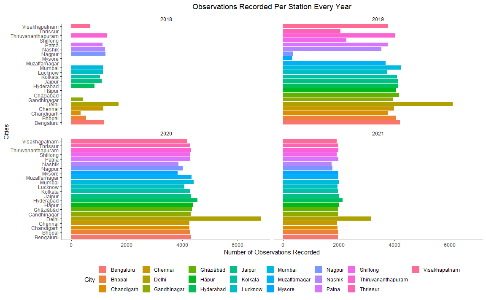
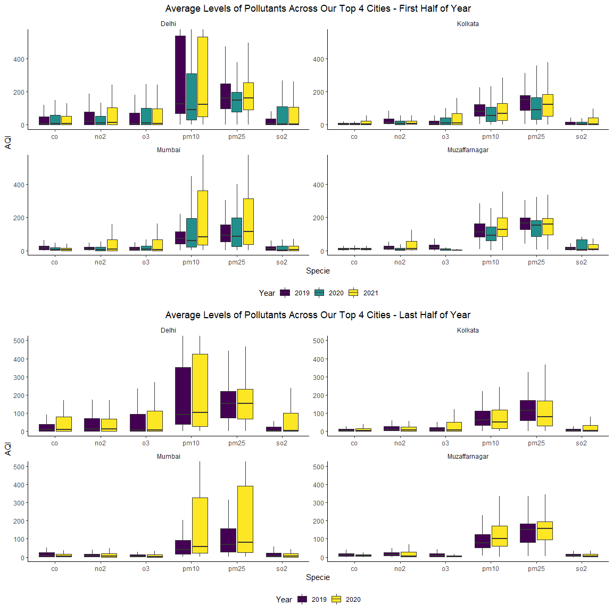
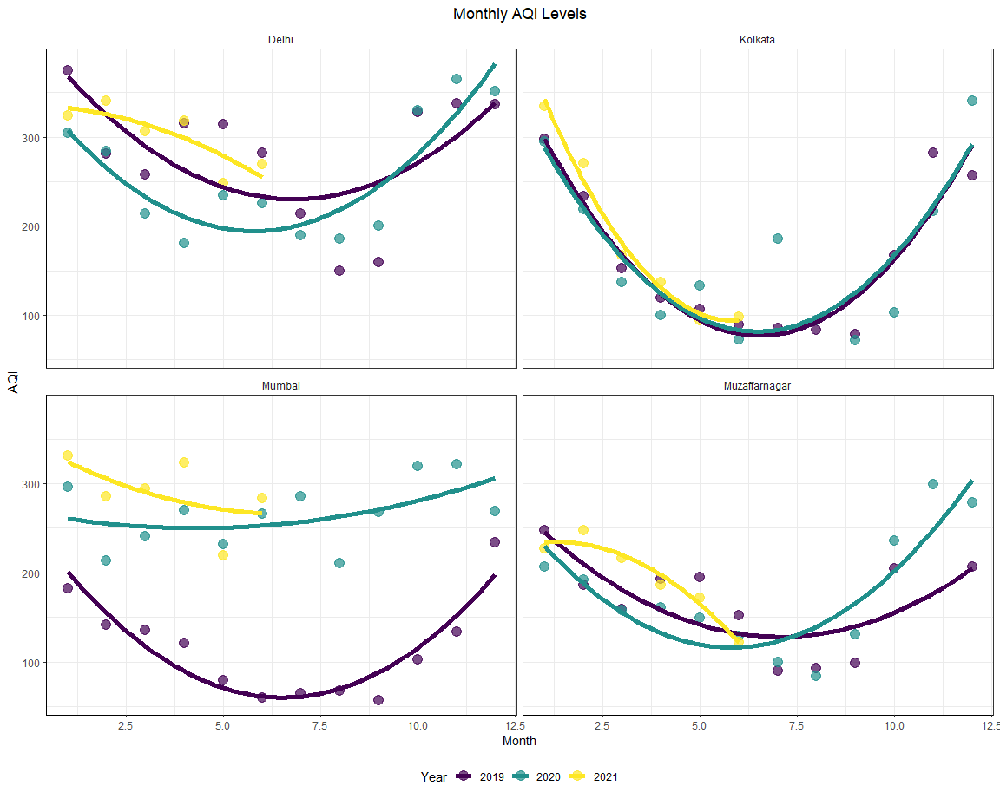
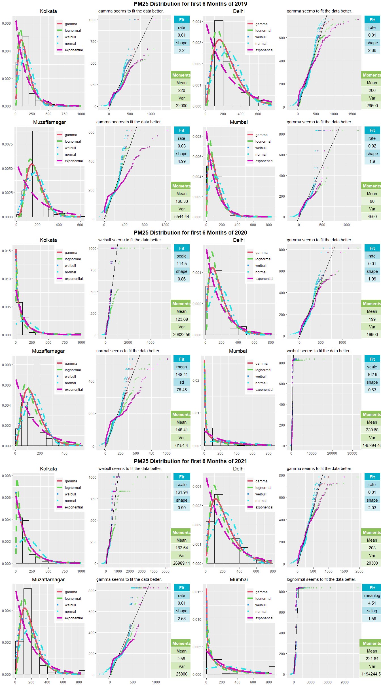
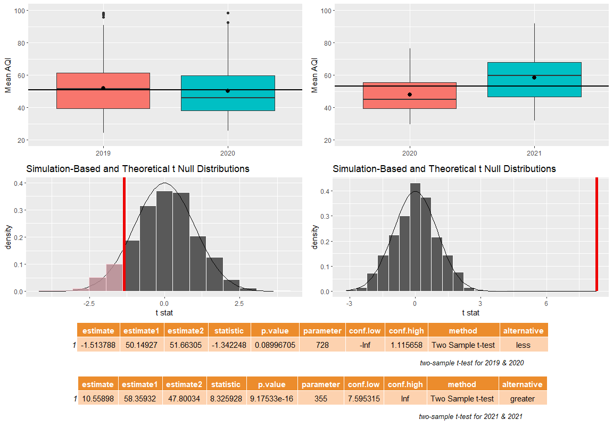
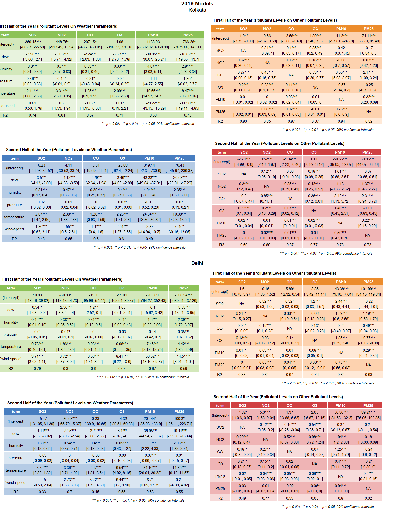

# INTRODUCTION

In this Data Analysis Project, I am going to work with **Air Quality Index (AQI) Data of India**. I will be using several Statistical Tools to Analyze the Data which includes Exploratory Data Analysis, Techniques and methodologies used for Inference and Modelling.

### MOTIVE

-   To understand the relationship that holds between different parameters which we measure as a part of AQI Data of India.

-   To find out if COVID-19 Nation-wise Lockdowns, Social Distancing and Closure of Industries, Factories and Suspension of movement via private vehicles and public transport had a significant impact on India's AQI.

## UNDERSTANDING THE DATA

Let's take a look at the Data

<table class="table" style="margin-left: auto; margin-right: auto;">
<caption>First few rows of the Air Quality Index Data</caption>
 <thead>
  <tr>
   <th style="text-align:right;"> Year </th>
   <th style="text-align:right;"> Month </th>
   <th style="text-align:right;"> Day </th>
   <th style="text-align:left;"> City </th>
   <th style="text-align:left;"> Specie </th>
   <th style="text-align:right;"> count </th>
   <th style="text-align:right;"> min </th>
   <th style="text-align:right;"> max </th>
   <th style="text-align:right;"> median </th>
   <th style="text-align:right;"> variance </th>
  </tr>
 </thead>
<tbody>
  <tr>
   <td style="text-align:right;"> 2014 </td>
   <td style="text-align:right;"> 12 </td>
   <td style="text-align:right;"> 29 </td>
   <td style="text-align:left;"> Delhi </td>
   <td style="text-align:left;"> pm25 </td>
   <td style="text-align:right;"> 24 </td>
   <td style="text-align:right;"> 296.0 </td>
   <td style="text-align:right;"> 460.0 </td>
   <td style="text-align:right;"> 394.0 </td>
   <td style="text-align:right;"> 27226.40 </td>
  </tr>
  <tr>
   <td style="text-align:right;"> 2014 </td>
   <td style="text-align:right;"> 12 </td>
   <td style="text-align:right;"> 29 </td>
   <td style="text-align:left;"> Hyderabad </td>
   <td style="text-align:left;"> pm25 </td>
   <td style="text-align:right;"> 13 </td>
   <td style="text-align:right;"> 159.0 </td>
   <td style="text-align:right;"> 162.0 </td>
   <td style="text-align:right;"> 161.0 </td>
   <td style="text-align:right;"> 8.59 </td>
  </tr>
  <tr>
   <td style="text-align:right;"> 2014 </td>
   <td style="text-align:right;"> 12 </td>
   <td style="text-align:right;"> 29 </td>
   <td style="text-align:left;"> Delhi </td>
   <td style="text-align:left;"> pm10 </td>
   <td style="text-align:right;"> 82 </td>
   <td style="text-align:right;"> 79.0 </td>
   <td style="text-align:right;"> 999.0 </td>
   <td style="text-align:right;"> 218.0 </td>
   <td style="text-align:right;"> 634717.00 </td>
  </tr>
  <tr>
   <td style="text-align:right;"> 2014 </td>
   <td style="text-align:right;"> 12 </td>
   <td style="text-align:right;"> 29 </td>
   <td style="text-align:left;"> Delhi </td>
   <td style="text-align:left;"> o3 </td>
   <td style="text-align:right;"> 79 </td>
   <td style="text-align:right;"> 0.1 </td>
   <td style="text-align:right;"> 87.4 </td>
   <td style="text-align:right;"> 3.2 </td>
   <td style="text-align:right;"> 2324.38 </td>
  </tr>
  <tr>
   <td style="text-align:right;"> 2014 </td>
   <td style="text-align:right;"> 12 </td>
   <td style="text-align:right;"> 29 </td>
   <td style="text-align:left;"> Delhi </td>
   <td style="text-align:left;"> so2 </td>
   <td style="text-align:right;"> 91 </td>
   <td style="text-align:right;"> 0.3 </td>
   <td style="text-align:right;"> 21.2 </td>
   <td style="text-align:right;"> 4.2 </td>
   <td style="text-align:right;"> 231.83 </td>
  </tr>
  <tr>
   <td style="text-align:right;"> 2014 </td>
   <td style="text-align:right;"> 12 </td>
   <td style="text-align:right;"> 29 </td>
   <td style="text-align:left;"> Delhi </td>
   <td style="text-align:left;"> pm25 </td>
   <td style="text-align:right;"> 83 </td>
   <td style="text-align:right;"> 139.0 </td>
   <td style="text-align:right;"> 747.0 </td>
   <td style="text-align:right;"> 307.0 </td>
   <td style="text-align:right;"> 215149.00 </td>
  </tr>
</tbody>
</table>

<table class="table" style="margin-left: auto; margin-right: auto;">
<caption>Last few rows of the Air Quality Index Data</caption>
 <thead>
  <tr>
   <th style="text-align:right;"> Year </th>
   <th style="text-align:right;"> Month </th>
   <th style="text-align:right;"> Day </th>
   <th style="text-align:left;"> City </th>
   <th style="text-align:left;"> Specie </th>
   <th style="text-align:right;"> count </th>
   <th style="text-align:right;"> min </th>
   <th style="text-align:right;"> max </th>
   <th style="text-align:right;"> median </th>
   <th style="text-align:right;"> variance </th>
  </tr>
 </thead>
<tbody>
  <tr>
   <td style="text-align:right;"> 2021 </td>
   <td style="text-align:right;"> 6 </td>
   <td style="text-align:right;"> 24 </td>
   <td style="text-align:left;"> Kolkata </td>
   <td style="text-align:left;"> o3 </td>
   <td style="text-align:right;"> 48 </td>
   <td style="text-align:right;"> 2.9 </td>
   <td style="text-align:right;"> 105.7 </td>
   <td style="text-align:right;"> 8.4 </td>
   <td style="text-align:right;"> 4611.99 </td>
  </tr>
  <tr>
   <td style="text-align:right;"> 2021 </td>
   <td style="text-align:right;"> 6 </td>
   <td style="text-align:right;"> 24 </td>
   <td style="text-align:left;"> Kolkata </td>
   <td style="text-align:left;"> pm25 </td>
   <td style="text-align:right;"> 48 </td>
   <td style="text-align:right;"> 45.0 </td>
   <td style="text-align:right;"> 104.0 </td>
   <td style="text-align:right;"> 63.0 </td>
   <td style="text-align:right;"> 1398.61 </td>
  </tr>
  <tr>
   <td style="text-align:right;"> 2021 </td>
   <td style="text-align:right;"> 6 </td>
   <td style="text-align:right;"> 24 </td>
   <td style="text-align:left;"> Kolkata </td>
   <td style="text-align:left;"> pressure </td>
   <td style="text-align:right;"> 56 </td>
   <td style="text-align:right;"> 996.9 </td>
   <td style="text-align:right;"> 1007.5 </td>
   <td style="text-align:right;"> 999.3 </td>
   <td style="text-align:right;"> 67.94 </td>
  </tr>
  <tr>
   <td style="text-align:right;"> 2021 </td>
   <td style="text-align:right;"> 6 </td>
   <td style="text-align:right;"> 24 </td>
   <td style="text-align:left;"> Kolkata </td>
   <td style="text-align:left;"> wind-speed </td>
   <td style="text-align:right;"> 56 </td>
   <td style="text-align:right;"> 0.1 </td>
   <td style="text-align:right;"> 4.2 </td>
   <td style="text-align:right;"> 1.1 </td>
   <td style="text-align:right;"> 10.87 </td>
  </tr>
  <tr>
   <td style="text-align:right;"> 2021 </td>
   <td style="text-align:right;"> 6 </td>
   <td style="text-align:right;"> 24 </td>
   <td style="text-align:left;"> Kolkata </td>
   <td style="text-align:left;"> dew </td>
   <td style="text-align:right;"> 37 </td>
   <td style="text-align:right;"> 28.0 </td>
   <td style="text-align:right;"> 28.0 </td>
   <td style="text-align:right;"> 28.0 </td>
   <td style="text-align:right;"> 0.00 </td>
  </tr>
  <tr>
   <td style="text-align:right;"> 2021 </td>
   <td style="text-align:right;"> 6 </td>
   <td style="text-align:right;"> 24 </td>
   <td style="text-align:left;"> Kolkata </td>
   <td style="text-align:left;"> co </td>
   <td style="text-align:right;"> 48 </td>
   <td style="text-align:right;"> 1.0 </td>
   <td style="text-align:right;"> 5.2 </td>
   <td style="text-align:right;"> 2.3 </td>
   <td style="text-align:right;"> 16.41 </td>
  </tr>
</tbody>
</table>

-   This Dataset contains 263890 rows and 10 columns.

-   The Year ranges from 2014 to 2021 (till June), with observations recorded on each of the 30 /31 days of the month for 12 months for the last 3 years.

-   The Data is generated from the 22 cities from various Stations located near that Cities. The Cities include:

<table class="table" style="margin-left: auto; margin-right: auto;">
<caption>City Stations</caption>
 <thead>
  <tr>
   <th style="text-align:left;"> State </th>
   <th style="text-align:left;"> City </th>
   <th style="text-align:right;"> Number of Stations </th>
  </tr>
 </thead>
<tbody>
  <tr>
   <td style="text-align:left;"> Andhra_Pradesh </td>
   <td style="text-align:left;"> Visakhapatnam </td>
   <td style="text-align:right;"> 1 </td>
  </tr>
  <tr>
   <td style="text-align:left;"> Arunachal_Pradesh </td>
   <td style="text-align:left;"> Visakhapatnam </td>
   <td style="text-align:right;"> 1 </td>
  </tr>
  <tr>
   <td style="text-align:left;"> Bihar </td>
   <td style="text-align:left;"> Patna </td>
   <td style="text-align:right;"> 6 </td>
  </tr>
  <tr>
   <td style="text-align:left;"> Chandigarh </td>
   <td style="text-align:left;"> Chandigarh </td>
   <td style="text-align:right;"> 1 </td>
  </tr>
  <tr>
   <td style="text-align:left;"> Delhi </td>
   <td style="text-align:left;"> Delhi </td>
   <td style="text-align:right;"> 40 </td>
  </tr>
  <tr>
   <td style="text-align:left;"> Kerala </td>
   <td style="text-align:left;"> Thiruvananthapuram </td>
   <td style="text-align:right;"> 2 </td>
  </tr>
  <tr>
   <td style="text-align:left;"> Kerala </td>
   <td style="text-align:left;"> Thrissur </td>
   <td style="text-align:right;"> 1 </td>
  </tr>
  <tr>
   <td style="text-align:left;"> MadhyaPradesh </td>
   <td style="text-align:left;"> Bhopal </td>
   <td style="text-align:right;"> 1 </td>
  </tr>
  <tr>
   <td style="text-align:left;"> Maharashtra </td>
   <td style="text-align:left;"> Mumbai </td>
   <td style="text-align:right;"> 21 </td>
  </tr>
  <tr>
   <td style="text-align:left;"> Maharashtra </td>
   <td style="text-align:left;"> Nagpur </td>
   <td style="text-align:right;"> 1 </td>
  </tr>
  <tr>
   <td style="text-align:left;"> Maharashtra </td>
   <td style="text-align:left;"> Nashik </td>
   <td style="text-align:right;"> 1 </td>
  </tr>
  <tr>
   <td style="text-align:left;"> Meghalaya </td>
   <td style="text-align:left;"> Shillong </td>
   <td style="text-align:right;"> 1 </td>
  </tr>
  <tr>
   <td style="text-align:left;"> Rajasthan </td>
   <td style="text-align:left;"> Jaipur </td>
   <td style="text-align:right;"> 3 </td>
  </tr>
  <tr>
   <td style="text-align:left;"> Tamil_Nadu </td>
   <td style="text-align:left;"> Chennai </td>
   <td style="text-align:right;"> 8 </td>
  </tr>
  <tr>
   <td style="text-align:left;"> Telangana </td>
   <td style="text-align:left;"> Hyderabad </td>
   <td style="text-align:right;"> 6 </td>
  </tr>
  <tr>
   <td style="text-align:left;"> Uttar_Pradesh </td>
   <td style="text-align:left;"> Lucknow </td>
   <td style="text-align:right;"> 6 </td>
  </tr>
  <tr>
   <td style="text-align:left;"> Uttar_Pradesh </td>
   <td style="text-align:left;"> Muzaffarnagar </td>
   <td style="text-align:right;"> 1 </td>
  </tr>
  <tr>
   <td style="text-align:left;"> West_Bengal </td>
   <td style="text-align:left;"> Kolkata </td>
   <td style="text-align:right;"> 7 </td>
  </tr>
</tbody>
</table>

-   The parameters which we measure at the different Stations are given under the Specie Column and it includes -

<table class="table" style="margin-left: auto; margin-right: auto;">
<caption>Specie Description</caption>
 <thead>
  <tr>
   <th style="text-align:left;"> Parameters </th>
   <th style="text-align:left;"> Description </th>
   <th style="text-align:left;"> Units </th>
  </tr>
 </thead>
<tbody>
  <tr>
   <td style="text-align:left;"> pm25 </td>
   <td style="text-align:left;"> Particle pollution/particulate matter(particles less than or equal to 2.5 micrometers in diameter) </td>
   <td style="text-align:left;"> micrograms/cubic meter </td>
  </tr>
  <tr>
   <td style="text-align:left;"> pm10 </td>
   <td style="text-align:left;"> Particle pollution/particulate matter(particles less than or equal to 10 micrometers in diameter) </td>
   <td style="text-align:left;"> micrograms/cubic meter </td>
  </tr>
  <tr>
   <td style="text-align:left;"> o3 </td>
   <td style="text-align:left;"> Ground-level ozone </td>
   <td style="text-align:left;"> micrograms/cubic meter </td>
  </tr>
  <tr>
   <td style="text-align:left;"> so2 </td>
   <td style="text-align:left;"> Sulphur dioxide </td>
   <td style="text-align:left;"> micrograms/cubic meter </td>
  </tr>
  <tr>
   <td style="text-align:left;"> no2 </td>
   <td style="text-align:left;"> Nitrogen dioxide </td>
   <td style="text-align:left;"> micrograms/cubic meter </td>
  </tr>
  <tr>
   <td style="text-align:left;"> co </td>
   <td style="text-align:left;"> Carbon Monoxide </td>
   <td style="text-align:left;"> miligrams/cubic meter </td>
  </tr>
  <tr>
   <td style="text-align:left;"> temperature </td>
   <td style="text-align:left;"> Temperature </td>
   <td style="text-align:left;"> Celcius </td>
  </tr>
  <tr>
   <td style="text-align:left;"> pressure </td>
   <td style="text-align:left;"> Air Pressure </td>
   <td style="text-align:left;"> Torr </td>
  </tr>
  <tr>
   <td style="text-align:left;"> wind-gust </td>
   <td style="text-align:left;"> Wind Gust/Force </td>
   <td style="text-align:left;"> kmph </td>
  </tr>
  <tr>
   <td style="text-align:left;"> humidity </td>
   <td style="text-align:left;"> Relative Humidity </td>
   <td style="text-align:left;"> No Units </td>
  </tr>
  <tr>
   <td style="text-align:left;"> wind-speed </td>
   <td style="text-align:left;"> Wind Speed </td>
   <td style="text-align:left;"> kmph </td>
  </tr>
  <tr>
   <td style="text-align:left;"> dew </td>
   <td style="text-align:left;"> Dew Point </td>
   <td style="text-align:left;"> Celcius </td>
  </tr>
  <tr>
   <td style="text-align:left;"> precipitation </td>
   <td style="text-align:left;"> Precipitation </td>
   <td style="text-align:left;"> milimeters </td>
  </tr>
</tbody>
</table>

AQI is a comparable and communicable way of measuring the parameters in the Air. It is calculated when atleast 3 of the top 6 parameter's data is available of which one must be pm10 or pm25. It is the max of the parameters recorded given they satisfy the above condition.

-   It also helps in identifying faulty standards and inadequate monitoring programmes.

-   AQI helps in analysing the change in air quality (improvement or degradation).

-   Comparing air quality conditions at different locations/cities.

-   It can be easily interpreted by anyone, without knowing about background details.

<table class="table" style="margin-left: auto; margin-right: auto;">
<caption>Significance of the AQI Values</caption>
 <thead>
  <tr>
   <th style="text-align:left;"> AQI Values </th>
   <th style="text-align:left;"> Level of Health Concern </th>
  </tr>
 </thead>
<tbody>
  <tr>
   <td style="text-align:left;"> 0-50 </td>
   <td style="text-align:left;"> Good </td>
  </tr>
  <tr>
   <td style="text-align:left;"> 51-100 </td>
   <td style="text-align:left;"> Moderate </td>
  </tr>
  <tr>
   <td style="text-align:left;"> 101-150 </td>
   <td style="text-align:left;"> Unhealthy for sensitive group </td>
  </tr>
  <tr>
   <td style="text-align:left;"> 151-200 </td>
   <td style="text-align:left;"> Unhealthy </td>
  </tr>
  <tr>
   <td style="text-align:left;"> 201-300 </td>
   <td style="text-align:left;"> Very Unhealthy </td>
  </tr>
  <tr>
   <td style="text-align:left;"> 301-500 </td>
   <td style="text-align:left;"> Hazardous </td>
  </tr>
</tbody>
</table>

In further Analysis we will refer *pm25, pm10, o3, so2, no2 and co2 as pollutants* and the *remaining weather parameters as non-pollutants*.

## TOP CITY STATIONS

Here we look at *which city records how many observations per year*.

<!-- -->

It seems **Delhi is the most monitored cities among the others**. We see all the other stations have almost equal number of observations per year. Our data seems to have lot of missing values for the year 2018 and the years before that; Hence we will only consider the data of the year 2019, 2020 and 2021.

Speculating on the reason *why Delhi is so heavily monitored* we look at *how the Average Median AQI Levels of pollutants at each city every year*.

<!-- -->

Indeed it is clearly visible that **Delhi's AQI Levels of Pollutants is higher** than all other cities. This makes Delhi our city of main focus in all the further analysis. Every city owing to it's location at different parts of the country, different development status, different population, different local weather conditions has different measured values of AQI. So, it makes sense to look at them separately. So, whenever we will look at City-wise Analysis, we will look at these Cities as our **Top 4 Cities** - **Delhi, Muzaffarnagar, Kolkata, Mumbai.**

# VISUAL OVERVIEW

Here we will take a visual tour of the Data through Exploratory Data Analysis.

-   Let's see the AQI Levels in the Top 4 across all 3 measures - Max, Median and Min splitting the year into two halves.

<!-- -->

The first bit of observation is the **Median & Min AQI Levels of all 4 cities have dropped in 2020 and 2021 is similar to 2019**. But the **Max AQI Levels have increased in 2020 and even more in 2021** even though we had so many restrictions in 2020!

<!-- -->

In the first half of the year 2020 Min and Median AQI Levels have dropped whereas in the second half of the year it either increased or remained same as that of 2019. 2021's observed values are pretty much the same as that of 2019 if not more. Max AQI Levels kept rising across the years irrespective of the part of the years. **The spread(Variance) of the resp. measures look the same across the years**.

-   Let's take a look at the pollutant-wise Levels in our Top 4 Cities.

<!-- -->

Here we see an interesting effect of Lockdowns. **All the pollutants have decreased considerably in the First half of 2020 whereas in the Second half it has bumped up again to match the Levels of 2019 or even more! While the Levels of 2021 & 2019 are very similar**.

## RELATIONSHIPS - PATTERNS & TRENDS

-   Pollutant Gases and Particulate Matter, whose levels despite being affected by Human Intervention and Industrial Activities, are nothing but Natural Gases which follow nature's process. Here we will take a look at *how the AQI Levels change with seasons throughout the year*.

<!-- -->

Indeed it looks like the **AQI Levels have dropped in the first half of 2020 compared to 2019, with the exception of Mumbai. But it has increased to levels more than 2019 in the later half. The AQI Levels of 2021 is more that both the previous years**. I have fit here a Quadratic Model which seems to model the situation well though we shouldn't focus on the model fit to 2021 as we only have the data pertaining to first 6 months.

Now, we will see the above observed AQI Levels in terms of Levels of each Pollutants.

<!-- -->

**Except for Ground-Level Ozone and Sulphur Dioxide most of the Pollutant Levels have decreased during the first half of 2020 which saw an increase in the second half when compared to 2019.This increase can be attributed to increased Stubble Burning that took place in the later half of the Year**. The surprising thing is that even **particulate matter increased to much higher levels in Mumbai** even though it saw a massive lockdown and transportation as well as industrial work were suspended.

-   The Pollutant Levels are affected to a great deal by the weather conditions of a place. Here we try to look at *how the Pollutant Levels are related to other Pollutant Levels* and *how the weather parameters are related among themselves* followed by a dependency of *Pollutant Levels of weather parameters*.

<!-- -->

We see a **strong linear relationship between the pollutants** among themselves across the past 3 years at our Top Cities.

<!-- -->

We see a **strong linear relationship between the weather parameters** across the past 3 years. One important thing that gives us a hint towards *why the pm10 and pm25 levels were higher in Mumbai*, as we see **Mumbai has experienced really high wind-speeds in 2020 and 2021. The pm content was thus increased due to movement of lots of dust by wind**.

<!-- -->

This suggests that there is a **positive linear relationship between Temperature & Humidity and all the Pollutant Levels**. **Wind speed is indeed positively correlated with pm10 and pm25 which might be the cause for higher AQI in Mumbai**.

-   Another Important thing to keep in mind is *how the weather parameters change with seasons*.

<!-- -->

It suggests that the **wind-speeds and humidity were higher in 2020, whereas pressure and temperatures were lower in 2020**.

# STATISTICAL INFERENCE

## ESTIMATION

### DISTRIBUTIONS & PROBABILITY MODELS

To perform any kind of analysis we need to model the data we have in order to get an idea about the expected value, variance and other properties related to the data. It also helps us get rid of the noise we get from the data we collect.

-   Here we will look at *how the different pollutants are distributed and how different are the models for different year & location and which probability model fits our data and what are the parameter estimates of the fitted model along with Mean and Variance.*

<!-- -->

I have mostly tried **fitting one of Gamma, Lognormal, Normal, Weibull and Exponential Distribution by the Method of Maximum Likelihood Estimation** after looking at the histograms of the data for all the Pollutants. The **better model out of all these 5 models was chosen based on Chi-Squre test for goodness of fit**.

Looking at the moments of the fitted distribution we see one of the most important factor contributing to AQI Calculation i.e. **pm25 Levels during the first 6 months were much lower in all the cities except Mumbai in 2020 compared to 2019, whereas these levels increased back to a much higher value in 2021**.

Similar **Fitted Probability Models suggests almost all the Pollutant Levels were lower in 2020 compared to that of 2019, but the values of 2019 and 2021 are very similar, if not that of 2021 is higher**. I will attach all the relevant Plots and figures for other Pollutants at the end, if interested in looking at them.

There were also some cases were **outliers degraded the fit of the model, I tried minimizing the Hellinger Distance to fit the model in that case**. Below give is one such case -

<!-- -->

It is clear that the **Hellinger fit is much better in fitting the part of the distribution where there are maximum observations**.

## HYPOTHESIS TESTING

Here we would try to Test some of out believes about the data, which will help us get a better understanding of the Pollutant and AQI Levels.

-   In the Introduction part we saw how the number of observations recorded by different cities looked similar except for Delhi which was obviously very high and need not be tested. We would like to *test our null Hypothesis of the number of observations recorded by all cities are equal against all other possible alternatives.* We perform a **Chi-square Equality of proportion Test**

<!-- -->

Hence, it is clearly visible **all other cities except Delhi are equally monitored in 2019 & 2020, where Delhi is more heavily monitored**.

-   Now the Question that rises is *whether the Mean Level of Pollutants in 2020 Less than that of 2019?* Along with it we will also find out *whether the Mean Level of Pollutants in 2021 More than that of 2020* (Considering the Data of the First 6 months of 2020 and 2021)?

So, to Test our Hypothesis of the Mean Pollutant Level of 2020 is equal to that of 2019 against the Alternative that the Mean Pollutant Level has Dropped in 2020, we will perform a **two sample t-test for equality of mean**. Here after looking at the boxplots, the variances for each year looks more or less the same, and I took variances of both the samples to be same.

<!-- -->

So, **it is true that 2021's Pollutant Levels are more than that of 2020 to be precise it is atleast 7.5 points higher with 99% Confidence** when comparing the first 6 months. But it is surprising that **2020's Pollutant Levels haven't dropped significantly compared to 2019** despite Lockdowns and all other measures which were favorable for decrease of Air Pollutant Levels.

Now, we try to look at the first half and later half of the Years separately, cause the Nation-wide Lockdown was there during the First Half of 2020. We test the same hypothesis as above, but now on split data.

<!-- -->

Indeed our guess was right here. The **Pollutant Levels have decreased during the first half of 2020 by atleast 6.4 points with 99% confidence and we reject our Null Hypothesis**.

An Interesting look at the second half of 2020 and performing an *Hypothesis testing for the Mean Level of Pollutants for 2019 and 2020 are equal against that of 2020 was higher* reveals that **2020's Level was higher in the second half**.

<!-- -->

-   Now we turn to finding out *how different are the Mean AQI Levels of Each Pollutants*.

Considering the First Half of 2019, 2020 and 2021:

Here we will perform **two-sample t-tests** and will find **99% confidence interval for difference of two mean assuming same variance**. Our Tests are to be performed with *Null Hypothesis being 2020 and 2019 Mean Level of Pollutants are same against the alternative that the Mean Pollutant Level of 2020 being less than 2019*. Similarly we will perform a test for *2021's Mean Level being higher than 2020's*. And we will test *whether Mean of 2021 and 2019 are equal, which will be a both-sided test*.

The first row of each table corresponds to the first test, second row to second test and third row to third test from the tests mentioned above.

<!-- -->

Indeed! In case of most of the Pollutants our guess seem to hold! And **2020's Pollutant Levels dropped when compared to 2019 and 2021, whereas the means of 2021 and 2019 are similar**.

A similar Test Considering the second half of 2020 and 2019, where we *test the null against the alternative of 2020's Mean Level of Pollutant being higher than that of 2019*, reveals -

<!-- -->

That **almost all the Pollutant's Levels have either gone up or remained same as that of 2019's**. A possible cause for this to happen **maybe due to a 40% increase in Stubble Burning during the later half of 2020 as per what various reports suggests**.

# MODELING

In this section we will try to analyze the data and will provide a quantitative way to summarize the trends and patterns. We will mostly be using concepts and techniques pertaining to **Multiple Linear Regression(MLR)**.

## REGRESSION

Here we will try to fit a MLR to the strong linear relationship we saw in the Visual Overview Section. Because of the difficulty in visualization, residuals will play an important role in deciding model fit.

-   We will look at *what is the linear relationship between each Pollutant Level and weather parameters*, *what is the linear relationship between each Pollutant with other Pollutant* We will also look at the *standard error of our the estimates and their confidence intervals* and *how much the weather parameters explains the variation in the pollutant levels.*

-   Some assumptions made during Modelling are-

    -   The weather parameters are independent of the Level of pollutants.

    -   The weather parameters are similarly distributed across 2019, 2020 and 2021 [Except for Mumbai where we see an increased wind-speed in the later two years]

In most of the models which we will try to fit we will look at the first half and the second half of the year separately.

1.  Model Based on 2019

<!-- -->

I have presented here the models for Kolkata and Delhi only. Other models for other cities will be attached at the end if interested to take a look at them. We have fit a **MLR model with each pollutants as the response and the weather parameters as the predictors** and similarly to figure out the strong relationship between the pollutants among themselves we have fit a separate **MLR model considering only the other pollutant's Levels**. The reason behind splitting the year into 2 parts are as can be seen from the visual overview section the **first half of the year has weather parameter levels much different from that of the second half** and the second reason being **we have data for the year 2021 till first 6 months only so fitting a model for the first half of the year will help us compare it with the year 2021**.

We see an interesting thing that is in the **first half of the year, the weather parameters are able to explain the pollutant Levels much better compared to that of the second half**. The **strength of the relationship of Pollutant Levels on other Pollutant Levels remains almost similar during both halves of the year. Temperature, Humidity and Dew have high significant effect throughout the year in explaining the Pollutant Levels throughout the year, which can be due to the intricate physical relationship that exists between this quantities i.e. concentration of gas being directly proportional to temperature, etc.**

The confidence intervals are mentioned under each coefficient giving us information about it's significance of being present in the model. Any coefficient which includes 0 in its confidence interval can be thought of being less important in explaining the response.

-   How well will take a look at *how the residuals of the above mentioned models are spread*

<!-- -->

Indeed it seems that the **residuals are normally distributed with mean around 0**. Therefore our model doesn't seems to have an issue in assuming that the **relationship is linear between Pollutant Levels and weather parameters**.

-   Now since, we have assumed that the weather parameters remains similar in all the years. It would be interesting to see *how well our model fitted with 2019's weather parameter performs when used on 2020's first 6 Months Data & 2021's first 6 Months Data.*

<!-- -->

We see an interesting thing that out **Model fitted with 2019 Weather parameters performs less well on 2020's Data as compared to 2021's. The histogram-density plots for residuals also shows our Model predicts higher values for the weather parameters in 2020 compared to the actual values observed which suggests that 2020's Pollutant Levels were lower during first 6 Months.**

2.  Model Based on 2020. We will take a Visual Look instead of the tables here, along with the estimate Distributions.

<!-- -->

**Kolkata saw more or less stable conditions of weather parameters throughout the first half of the year and hence not much of the variability of the Pollutants were explained by the weather Parameters. Delhi's dependence on Weather Parameters appear stronger.**

# CONCLUSION

-   In 2020, During Lockdown i.e. in the **first Half of the Year there was a drop in the Pollutant Levels and AQI Levels** across most of the Major Cities, our study included Kolkata, Delhi, Muzaffarnagar and Mumbai. Though the **Particulate Matter Levels in Mumbai were much higher which can be seen due to Cyclonic Impact of *Nisarga***.

-   Despite there being several restrictions on travel, transportation, industrial work which are major contributors to pollutant Levels, we saw an **increased Level of Pollutants in the second half of the year 2020 which surpassed the Levels of 2019** which maybe due to the **40% increase in the Stubble Burning during the end of the Year**.

-   **Coastal Regions tend to have lower AQI Levels and Pollutant Levels** mostly because of the influence of **winds and more Cyclonic Conditions**.

-   **Major Contributor to AQI Levels are particulate matters**. So reducing there levels will greatly help reducing the overall Air Quality.

# SUGGESTIONS

-   Introduction of Electric Powered Vehicles can greatly combat Air Pollution reducing Levels of NO2, SO2, CO which are released by Diesel and Petrol Powered Engines.

-   Controlled Stubble Burning can stabilize Air Quality throughout the later half of the Year.

# BIBLIOGRAPHY

-   The Dataset was collected from [Air Quality Open Data Platform](https://aqicn.org/data-platform/covid19/).

-   [More on Cyclone Nisarga](https://en.wikipedia.org/wiki/Cyclone_Nisarga)

-   As Per various [News Reports an Observations from SAFAR, there was a 40% Increase in Stubble Burning in 2020](https://www.google.co.in/search?q=safar+40+increase+in+stubble+burning+2020&sxsrf=ALeKk00JLE8JdJbIUsLZKL4jjMQj62KvoQ%3A1626027095459&ei=VzTrYITLG5mO4-EP6cCz-Ak&oq=safar+40+increase+in+stubble+burning+2020&gs_lcp=Cgdnd3Mtd2l6EAM6BwgjELADECc6BwgAEEcQsAM6BQghEKABOgQIIRAVSgQIQRgAUNN2WMp9YM2GAWgBcAJ4AIAB9gGIAbsJkgEFMC4zLjOYAQCgAQGqAQdnd3Mtd2l6yAEJwAEB&sclient=gws-wiz&ved=0ahUKEwjE0q37ztvxAhUZxzgGHWngDJ8Q4dUDCA0&uact=5)

-   All Relevant R-Codes, Files, Datasets, etc are present on [My Account](https://github.com/RishiDarkDevil/Stats_Project_AQI_2021)
