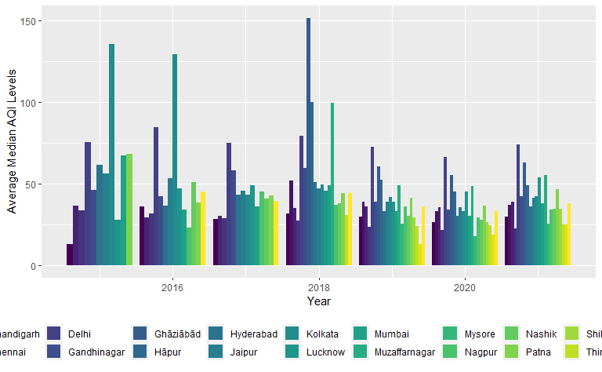
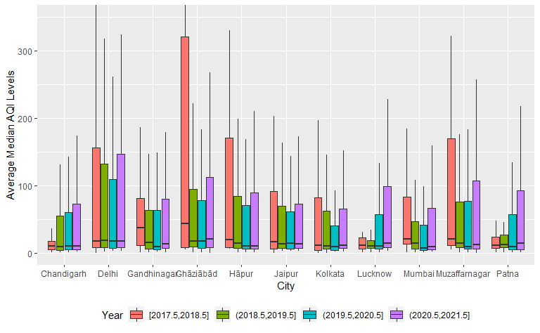

# INTRODUCTION

In this Data Analysis Project, I am going to work with **Air Quality Index Data of India**. I will be using several Statistical Tools to Analyze the Data which includes Exploratory Data Analysis, Techniques and methodologies used for Inference and will be Modelling the Data to summarize any pattern or general trend.

I will also try to find out if there was any significant drop in the levels pollutant gases in the Atmosphere due to imposing lockdowns in the year 2020 and 2021, when several industries, factories, transportation facilities were suspended to work. I will be comparing the data for 2020 and 2021 with the previous years.

### UNDERSTANDING THE DATASET

Let's take a look at the Data

<table class="table" style="margin-left: auto; margin-right: auto;">
<caption>First few rows of the Air Quality Index Data</caption>
 <thead>
  <tr>
   <th style="text-align:right;"> Year </th>
   <th style="text-align:right;"> Month </th>
   <th style="text-align:right;"> Day </th>
   <th style="text-align:left;"> City </th>
   <th style="text-align:left;"> Specie </th>
   <th style="text-align:right;"> count </th>
   <th style="text-align:right;"> min </th>
   <th style="text-align:right;"> max </th>
   <th style="text-align:right;"> median </th>
   <th style="text-align:right;"> variance </th>
  </tr>
 </thead>
<tbody>
  <tr>
   <td style="text-align:right;"> 2014 </td>
   <td style="text-align:right;"> 12 </td>
   <td style="text-align:right;"> 29 </td>
   <td style="text-align:left;"> Delhi </td>
   <td style="text-align:left;"> pm25 </td>
   <td style="text-align:right;"> 24 </td>
   <td style="text-align:right;"> 296.0 </td>
   <td style="text-align:right;"> 460.0 </td>
   <td style="text-align:right;"> 394.0 </td>
   <td style="text-align:right;"> 27226.40 </td>
  </tr>
  <tr>
   <td style="text-align:right;"> 2014 </td>
   <td style="text-align:right;"> 12 </td>
   <td style="text-align:right;"> 29 </td>
   <td style="text-align:left;"> Hyderabad </td>
   <td style="text-align:left;"> pm25 </td>
   <td style="text-align:right;"> 13 </td>
   <td style="text-align:right;"> 159.0 </td>
   <td style="text-align:right;"> 162.0 </td>
   <td style="text-align:right;"> 161.0 </td>
   <td style="text-align:right;"> 8.59 </td>
  </tr>
  <tr>
   <td style="text-align:right;"> 2014 </td>
   <td style="text-align:right;"> 12 </td>
   <td style="text-align:right;"> 29 </td>
   <td style="text-align:left;"> Delhi </td>
   <td style="text-align:left;"> pm10 </td>
   <td style="text-align:right;"> 82 </td>
   <td style="text-align:right;"> 79.0 </td>
   <td style="text-align:right;"> 999.0 </td>
   <td style="text-align:right;"> 218.0 </td>
   <td style="text-align:right;"> 634717.00 </td>
  </tr>
  <tr>
   <td style="text-align:right;"> 2014 </td>
   <td style="text-align:right;"> 12 </td>
   <td style="text-align:right;"> 29 </td>
   <td style="text-align:left;"> Delhi </td>
   <td style="text-align:left;"> o3 </td>
   <td style="text-align:right;"> 79 </td>
   <td style="text-align:right;"> 0.1 </td>
   <td style="text-align:right;"> 87.4 </td>
   <td style="text-align:right;"> 3.2 </td>
   <td style="text-align:right;"> 2324.38 </td>
  </tr>
  <tr>
   <td style="text-align:right;"> 2014 </td>
   <td style="text-align:right;"> 12 </td>
   <td style="text-align:right;"> 29 </td>
   <td style="text-align:left;"> Delhi </td>
   <td style="text-align:left;"> so2 </td>
   <td style="text-align:right;"> 91 </td>
   <td style="text-align:right;"> 0.3 </td>
   <td style="text-align:right;"> 21.2 </td>
   <td style="text-align:right;"> 4.2 </td>
   <td style="text-align:right;"> 231.83 </td>
  </tr>
  <tr>
   <td style="text-align:right;"> 2014 </td>
   <td style="text-align:right;"> 12 </td>
   <td style="text-align:right;"> 29 </td>
   <td style="text-align:left;"> Delhi </td>
   <td style="text-align:left;"> pm25 </td>
   <td style="text-align:right;"> 83 </td>
   <td style="text-align:right;"> 139.0 </td>
   <td style="text-align:right;"> 747.0 </td>
   <td style="text-align:right;"> 307.0 </td>
   <td style="text-align:right;"> 215149.00 </td>
  </tr>
</tbody>
</table>

<table class="table" style="margin-left: auto; margin-right: auto;">
<caption>Last few rows of the Air Quality Index Data</caption>
 <thead>
  <tr>
   <th style="text-align:right;"> Year </th>
   <th style="text-align:right;"> Month </th>
   <th style="text-align:right;"> Day </th>
   <th style="text-align:left;"> City </th>
   <th style="text-align:left;"> Specie </th>
   <th style="text-align:right;"> count </th>
   <th style="text-align:right;"> min </th>
   <th style="text-align:right;"> max </th>
   <th style="text-align:right;"> median </th>
   <th style="text-align:right;"> variance </th>
  </tr>
 </thead>
<tbody>
  <tr>
   <td style="text-align:right;"> 2021 </td>
   <td style="text-align:right;"> 6 </td>
   <td style="text-align:right;"> 24 </td>
   <td style="text-align:left;"> Kolkata </td>
   <td style="text-align:left;"> o3 </td>
   <td style="text-align:right;"> 48 </td>
   <td style="text-align:right;"> 2.9 </td>
   <td style="text-align:right;"> 105.7 </td>
   <td style="text-align:right;"> 8.4 </td>
   <td style="text-align:right;"> 4611.99 </td>
  </tr>
  <tr>
   <td style="text-align:right;"> 2021 </td>
   <td style="text-align:right;"> 6 </td>
   <td style="text-align:right;"> 24 </td>
   <td style="text-align:left;"> Kolkata </td>
   <td style="text-align:left;"> pm25 </td>
   <td style="text-align:right;"> 48 </td>
   <td style="text-align:right;"> 45.0 </td>
   <td style="text-align:right;"> 104.0 </td>
   <td style="text-align:right;"> 63.0 </td>
   <td style="text-align:right;"> 1398.61 </td>
  </tr>
  <tr>
   <td style="text-align:right;"> 2021 </td>
   <td style="text-align:right;"> 6 </td>
   <td style="text-align:right;"> 24 </td>
   <td style="text-align:left;"> Kolkata </td>
   <td style="text-align:left;"> pressure </td>
   <td style="text-align:right;"> 56 </td>
   <td style="text-align:right;"> 996.9 </td>
   <td style="text-align:right;"> 1007.5 </td>
   <td style="text-align:right;"> 999.3 </td>
   <td style="text-align:right;"> 67.94 </td>
  </tr>
  <tr>
   <td style="text-align:right;"> 2021 </td>
   <td style="text-align:right;"> 6 </td>
   <td style="text-align:right;"> 24 </td>
   <td style="text-align:left;"> Kolkata </td>
   <td style="text-align:left;"> wind-speed </td>
   <td style="text-align:right;"> 56 </td>
   <td style="text-align:right;"> 0.1 </td>
   <td style="text-align:right;"> 4.2 </td>
   <td style="text-align:right;"> 1.1 </td>
   <td style="text-align:right;"> 10.87 </td>
  </tr>
  <tr>
   <td style="text-align:right;"> 2021 </td>
   <td style="text-align:right;"> 6 </td>
   <td style="text-align:right;"> 24 </td>
   <td style="text-align:left;"> Kolkata </td>
   <td style="text-align:left;"> dew </td>
   <td style="text-align:right;"> 37 </td>
   <td style="text-align:right;"> 28.0 </td>
   <td style="text-align:right;"> 28.0 </td>
   <td style="text-align:right;"> 28.0 </td>
   <td style="text-align:right;"> 0.00 </td>
  </tr>
  <tr>
   <td style="text-align:right;"> 2021 </td>
   <td style="text-align:right;"> 6 </td>
   <td style="text-align:right;"> 24 </td>
   <td style="text-align:left;"> Kolkata </td>
   <td style="text-align:left;"> co </td>
   <td style="text-align:right;"> 48 </td>
   <td style="text-align:right;"> 1.0 </td>
   <td style="text-align:right;"> 5.2 </td>
   <td style="text-align:right;"> 2.3 </td>
   <td style="text-align:right;"> 16.41 </td>
  </tr>
</tbody>
</table>

-   This Data set contains 263890 rows and 10 columns.

-   The Year ranges from 2014 to 2021 (till June), with observations recorded on each of the 30 /31 days of the month for 12 months.

-   The Data is generated from the 22 City Stations for Real-Time Air-Quality Index Monitoring across the Country. The Cities include:

<table class="table" style="margin-left: auto; margin-right: auto;">
<caption>City Stations</caption>
 <thead>
  <tr>
   <th style="text-align:left;"> State </th>
   <th style="text-align:left;"> City </th>
   <th style="text-align:right;"> Number of Stations </th>
  </tr>
 </thead>
<tbody>
  <tr>
   <td style="text-align:left;"> Andhra_Pradesh </td>
   <td style="text-align:left;"> Visakhapatnam </td>
   <td style="text-align:right;"> 1 </td>
  </tr>
  <tr>
   <td style="text-align:left;"> Arunachal_Pradesh </td>
   <td style="text-align:left;"> Visakhapatnam </td>
   <td style="text-align:right;"> 1 </td>
  </tr>
  <tr>
   <td style="text-align:left;"> Bihar </td>
   <td style="text-align:left;"> Patna </td>
   <td style="text-align:right;"> 6 </td>
  </tr>
  <tr>
   <td style="text-align:left;"> Chandigarh </td>
   <td style="text-align:left;"> Chandigarh </td>
   <td style="text-align:right;"> 1 </td>
  </tr>
  <tr>
   <td style="text-align:left;"> Delhi </td>
   <td style="text-align:left;"> Delhi </td>
   <td style="text-align:right;"> 40 </td>
  </tr>
  <tr>
   <td style="text-align:left;"> Kerala </td>
   <td style="text-align:left;"> Thiruvananthapuram </td>
   <td style="text-align:right;"> 2 </td>
  </tr>
  <tr>
   <td style="text-align:left;"> Kerala </td>
   <td style="text-align:left;"> Thrissur </td>
   <td style="text-align:right;"> 1 </td>
  </tr>
  <tr>
   <td style="text-align:left;"> MadhyaPradesh </td>
   <td style="text-align:left;"> Bhopal </td>
   <td style="text-align:right;"> 1 </td>
  </tr>
  <tr>
   <td style="text-align:left;"> Maharashtra </td>
   <td style="text-align:left;"> Mumbai </td>
   <td style="text-align:right;"> 21 </td>
  </tr>
  <tr>
   <td style="text-align:left;"> Maharashtra </td>
   <td style="text-align:left;"> Nagpur </td>
   <td style="text-align:right;"> 1 </td>
  </tr>
  <tr>
   <td style="text-align:left;"> Maharashtra </td>
   <td style="text-align:left;"> Nashik </td>
   <td style="text-align:right;"> 1 </td>
  </tr>
  <tr>
   <td style="text-align:left;"> Meghalaya </td>
   <td style="text-align:left;"> Shillong </td>
   <td style="text-align:right;"> 1 </td>
  </tr>
  <tr>
   <td style="text-align:left;"> Rajasthan </td>
   <td style="text-align:left;"> Jaipur </td>
   <td style="text-align:right;"> 3 </td>
  </tr>
  <tr>
   <td style="text-align:left;"> Tamil_Nadu </td>
   <td style="text-align:left;"> Chennai </td>
   <td style="text-align:right;"> 8 </td>
  </tr>
  <tr>
   <td style="text-align:left;"> Telangana </td>
   <td style="text-align:left;"> Hyderabad </td>
   <td style="text-align:right;"> 6 </td>
  </tr>
  <tr>
   <td style="text-align:left;"> Uttar_Pradesh </td>
   <td style="text-align:left;"> Lucknow </td>
   <td style="text-align:right;"> 6 </td>
  </tr>
  <tr>
   <td style="text-align:left;"> Uttar_Pradesh </td>
   <td style="text-align:left;"> Muzaffarnagar </td>
   <td style="text-align:right;"> 1 </td>
  </tr>
  <tr>
   <td style="text-align:left;"> West_Bengal </td>
   <td style="text-align:left;"> Kolkata </td>
   <td style="text-align:right;"> 7 </td>
  </tr>
</tbody>
</table>

-   The parameters which we measure at the different Stations are given under the Specie Column and it includes -

<table class="table" style="margin-left: auto; margin-right: auto;">
<caption>Specie Description</caption>
 <thead>
  <tr>
   <th style="text-align:left;"> Parameters </th>
   <th style="text-align:left;"> Description </th>
   <th style="text-align:left;"> Units </th>
  </tr>
 </thead>
<tbody>
  <tr>
   <td style="text-align:left;"> pm25 </td>
   <td style="text-align:left;"> Particle pollution/particulate matter(particles less than or equal to 2.5 micrometers in diameter) </td>
   <td style="text-align:left;"> AQI </td>
  </tr>
  <tr>
   <td style="text-align:left;"> pm10 </td>
   <td style="text-align:left;"> Particle pollution/particulate matter(particles less than or equal to 10 micrometers in diameter) </td>
   <td style="text-align:left;"> AQI </td>
  </tr>
  <tr>
   <td style="text-align:left;"> o3 </td>
   <td style="text-align:left;"> Ground-level ozone </td>
   <td style="text-align:left;"> AQI </td>
  </tr>
  <tr>
   <td style="text-align:left;"> so2 </td>
   <td style="text-align:left;"> Sulfur dioxide </td>
   <td style="text-align:left;"> AQI </td>
  </tr>
  <tr>
   <td style="text-align:left;"> no2 </td>
   <td style="text-align:left;"> Nitrogen dioxide </td>
   <td style="text-align:left;"> AQI </td>
  </tr>
  <tr>
   <td style="text-align:left;"> co </td>
   <td style="text-align:left;"> Carbon Monoxide </td>
   <td style="text-align:left;"> AQI </td>
  </tr>
  <tr>
   <td style="text-align:left;"> temperature </td>
   <td style="text-align:left;"> Temperature </td>
   <td style="text-align:left;"> Degree Celcius </td>
  </tr>
  <tr>
   <td style="text-align:left;"> pressure </td>
   <td style="text-align:left;"> Air Pressure </td>
   <td style="text-align:left;"> NA </td>
  </tr>
  <tr>
   <td style="text-align:left;"> wind-gust </td>
   <td style="text-align:left;"> Wind Gust/Force </td>
   <td style="text-align:left;"> NA </td>
  </tr>
  <tr>
   <td style="text-align:left;"> humidity </td>
   <td style="text-align:left;"> Relative Humidity </td>
   <td style="text-align:left;"> NA </td>
  </tr>
  <tr>
   <td style="text-align:left;"> wind-speed </td>
   <td style="text-align:left;"> Wind Speed </td>
   <td style="text-align:left;"> NA </td>
  </tr>
  <tr>
   <td style="text-align:left;"> dew </td>
   <td style="text-align:left;"> Dew Point </td>
   <td style="text-align:left;"> NA </td>
  </tr>
  <tr>
   <td style="text-align:left;"> precipitation </td>
   <td style="text-align:left;"> Precipitation </td>
   <td style="text-align:left;"> NA </td>
  </tr>
</tbody>
</table>

The Air Quality Index (AQI) is an index for reporting air quality on a daily basis. It measures air pollution affects one's health within a short time period. The purpose of the AQI is to help people know how the local air quality impacts their health. The measurements in AQI are particularly helpful for our Data Analysis as it helps us compare the values at different stations and time points.

-   It also helps in identifying faulty standards and inadequate monitoring programmes.

-   AQI helps in analysing the change in air quality (improvement or degradation).

-   Comparing air quality conditions at different locations/cities.

<table class="table" style="margin-left: auto; margin-right: auto;">
<caption>Significance of the AQI Values</caption>
 <thead>
  <tr>
   <th style="text-align:left;"> AQI Values </th>
   <th style="text-align:left;"> Level of Health Concern </th>
  </tr>
 </thead>
<tbody>
  <tr>
   <td style="text-align:left;"> 0-50 </td>
   <td style="text-align:left;"> Good </td>
  </tr>
  <tr>
   <td style="text-align:left;"> 51-100 </td>
   <td style="text-align:left;"> Moderate </td>
  </tr>
  <tr>
   <td style="text-align:left;"> 101-150 </td>
   <td style="text-align:left;"> Unhealthy for sensitive group </td>
  </tr>
  <tr>
   <td style="text-align:left;"> 151-200 </td>
   <td style="text-align:left;"> Unhealthy </td>
  </tr>
  <tr>
   <td style="text-align:left;"> 201-300 </td>
   <td style="text-align:left;"> Very Unhealthy </td>
  </tr>
  <tr>
   <td style="text-align:left;"> 301-500 </td>
   <td style="text-align:left;"> Hazardous </td>
  </tr>
</tbody>
</table>

In further Analysis we will call pm25, pm10, o3, so2, no2 and co2 as pollutants and the remaining parameters as non-pollutants.

-   For Each parameters in Specie we measure it's minimum value, median value, maximum value and variance . The count variable is the number of times the measurement was taken for each of the parameters.

### TOP CITY STATIONS

Here we try to analyze which City Stations

-   Records More Observations compared to others, which will give us an idea of those centres being more frequently continuously recorded, which can be due to higher AQI Levels in the pollutants.

<table class="table" style="margin-left: auto; margin-right: auto;">
<caption>Observations recorded per City Station per Year</caption>
 <thead>
  <tr>
   <th style="text-align:left;"> City </th>
   <th style="text-align:right;"> 2014 </th>
   <th style="text-align:right;"> 2015 </th>
   <th style="text-align:right;"> 2016 </th>
   <th style="text-align:right;"> 2017 </th>
   <th style="text-align:right;"> 2018 </th>
   <th style="text-align:right;"> 2019 </th>
   <th style="text-align:right;"> 2020 </th>
   <th style="text-align:right;"> 2021 </th>
  </tr>
 </thead>
<tbody>
  <tr>
   <td style="text-align:left;"> Delhi </td>
   <td style="text-align:right;"> 21 </td>
   <td style="text-align:right;"> 1320 </td>
   <td style="text-align:right;"> 1328 </td>
   <td style="text-align:right;"> 1280 </td>
   <td style="text-align:right;"> 1713 </td>
   <td style="text-align:right;"> 6099 </td>
   <td style="text-align:right;"> 6844 </td>
   <td style="text-align:right;"> 3159 </td>
  </tr>
  <tr>
   <td style="text-align:left;"> Mumbai </td>
   <td style="text-align:right;"> 3 </td>
   <td style="text-align:right;"> 437 </td>
   <td style="text-align:right;"> 1110 </td>
   <td style="text-align:right;"> 1098 </td>
   <td style="text-align:right;"> 1154 </td>
   <td style="text-align:right;"> 4236 </td>
   <td style="text-align:right;"> 4415 </td>
   <td style="text-align:right;"> 2004 </td>
  </tr>
  <tr>
   <td style="text-align:left;"> Bengaluru </td>
   <td style="text-align:right;"> 5 </td>
   <td style="text-align:right;"> 524 </td>
   <td style="text-align:right;"> 1094 </td>
   <td style="text-align:right;"> 1097 </td>
   <td style="text-align:right;"> 1186 </td>
   <td style="text-align:right;"> 4210 </td>
   <td style="text-align:right;"> 4328 </td>
   <td style="text-align:right;"> 1971 </td>
  </tr>
  <tr>
   <td style="text-align:left;"> Ghaziabad </td>
   <td style="text-align:right;"> NA </td>
   <td style="text-align:right;"> NA </td>
   <td style="text-align:right;"> NA </td>
   <td style="text-align:right;"> NA </td>
   <td style="text-align:right;"> 11 </td>
   <td style="text-align:right;"> 4180 </td>
   <td style="text-align:right;"> 4356 </td>
   <td style="text-align:right;"> 1970 </td>
  </tr>
  <tr>
   <td style="text-align:left;"> Hyderabad </td>
   <td style="text-align:right;"> 3 </td>
   <td style="text-align:right;"> 401 </td>
   <td style="text-align:right;"> 1087 </td>
   <td style="text-align:right;"> 1089 </td>
   <td style="text-align:right;"> 848 </td>
   <td style="text-align:right;"> 4149 </td>
   <td style="text-align:right;"> 4556 </td>
   <td style="text-align:right;"> 2135 </td>
  </tr>
  <tr>
   <td style="text-align:left;"> Jaipur </td>
   <td style="text-align:right;"> NA </td>
   <td style="text-align:right;"> 6 </td>
   <td style="text-align:right;"> 1016 </td>
   <td style="text-align:right;"> 838 </td>
   <td style="text-align:right;"> 1103 </td>
   <td style="text-align:right;"> 4138 </td>
   <td style="text-align:right;"> 4329 </td>
   <td style="text-align:right;"> 2009 </td>
  </tr>
  <tr>
   <td style="text-align:left;"> Kolkata </td>
   <td style="text-align:right;"> 3 </td>
   <td style="text-align:right;"> 188 </td>
   <td style="text-align:right;"> 216 </td>
   <td style="text-align:right;"> 1096 </td>
   <td style="text-align:right;"> 1040 </td>
   <td style="text-align:right;"> 4097 </td>
   <td style="text-align:right;"> 4290 </td>
   <td style="text-align:right;"> 1972 </td>
  </tr>
  <tr>
   <td style="text-align:left;"> Hapur </td>
   <td style="text-align:right;"> NA </td>
   <td style="text-align:right;"> NA </td>
   <td style="text-align:right;"> NA </td>
   <td style="text-align:right;"> NA </td>
   <td style="text-align:right;"> 11 </td>
   <td style="text-align:right;"> 4067 </td>
   <td style="text-align:right;"> 4384 </td>
   <td style="text-align:right;"> 2020 </td>
  </tr>
  <tr>
   <td style="text-align:left;"> Bhopal </td>
   <td style="text-align:right;"> NA </td>
   <td style="text-align:right;"> NA </td>
   <td style="text-align:right;"> NA </td>
   <td style="text-align:right;"> NA </td>
   <td style="text-align:right;"> 544 </td>
   <td style="text-align:right;"> 4066 </td>
   <td style="text-align:right;"> 4273 </td>
   <td style="text-align:right;"> 1980 </td>
  </tr>
  <tr>
   <td style="text-align:left;"> Thiruvananthapuram </td>
   <td style="text-align:right;"> NA </td>
   <td style="text-align:right;"> NA </td>
   <td style="text-align:right;"> NA </td>
   <td style="text-align:right;"> NA </td>
   <td style="text-align:right;"> 1289 </td>
   <td style="text-align:right;"> 4020 </td>
   <td style="text-align:right;"> 4324 </td>
   <td style="text-align:right;"> 1981 </td>
  </tr>
  <tr>
   <td style="text-align:left;"> Chennai </td>
   <td style="text-align:right;"> 16 </td>
   <td style="text-align:right;"> 871 </td>
   <td style="text-align:right;"> 893 </td>
   <td style="text-align:right;"> 915 </td>
   <td style="text-align:right;"> 1157 </td>
   <td style="text-align:right;"> 3991 </td>
   <td style="text-align:right;"> 4265 </td>
   <td style="text-align:right;"> 1945 </td>
  </tr>
  <tr>
   <td style="text-align:left;"> Gandhinagar </td>
   <td style="text-align:right;"> 12 </td>
   <td style="text-align:right;"> 695 </td>
   <td style="text-align:right;"> 60 </td>
   <td style="text-align:right;"> 410 </td>
   <td style="text-align:right;"> 429 </td>
   <td style="text-align:right;"> 3943 </td>
   <td style="text-align:right;"> 4301 </td>
   <td style="text-align:right;"> 1966 </td>
  </tr>
  <tr>
   <td style="text-align:left;"> Patna </td>
   <td style="text-align:right;"> NA </td>
   <td style="text-align:right;"> 10 </td>
   <td style="text-align:right;"> 940 </td>
   <td style="text-align:right;"> 870 </td>
   <td style="text-align:right;"> 1132 </td>
   <td style="text-align:right;"> 3768 </td>
   <td style="text-align:right;"> 4284 </td>
   <td style="text-align:right;"> 1989 </td>
  </tr>
  <tr>
   <td style="text-align:left;"> Visakhapatnam </td>
   <td style="text-align:right;"> NA </td>
   <td style="text-align:right;"> NA </td>
   <td style="text-align:right;"> 34 </td>
   <td style="text-align:right;"> 1092 </td>
   <td style="text-align:right;"> 671 </td>
   <td style="text-align:right;"> 3768 </td>
   <td style="text-align:right;"> 4166 </td>
   <td style="text-align:right;"> 1930 </td>
  </tr>
  <tr>
   <td style="text-align:left;"> Chandigarh </td>
   <td style="text-align:right;"> NA </td>
   <td style="text-align:right;"> 5 </td>
   <td style="text-align:right;"> 777 </td>
   <td style="text-align:right;"> 905 </td>
   <td style="text-align:right;"> 337 </td>
   <td style="text-align:right;"> 3759 </td>
   <td style="text-align:right;"> 4263 </td>
   <td style="text-align:right;"> 1958 </td>
  </tr>
  <tr>
   <td style="text-align:left;"> Lucknow </td>
   <td style="text-align:right;"> 12 </td>
   <td style="text-align:right;"> 723 </td>
   <td style="text-align:right;"> 836 </td>
   <td style="text-align:right;"> 913 </td>
   <td style="text-align:right;"> 1143 </td>
   <td style="text-align:right;"> 3728 </td>
   <td style="text-align:right;"> 4080 </td>
   <td style="text-align:right;"> 1963 </td>
  </tr>
  <tr>
   <td style="text-align:left;"> Muzaffarnagar </td>
   <td style="text-align:right;"> NA </td>
   <td style="text-align:right;"> NA </td>
   <td style="text-align:right;"> NA </td>
   <td style="text-align:right;"> NA </td>
   <td style="text-align:right;"> 11 </td>
   <td style="text-align:right;"> 3691 </td>
   <td style="text-align:right;"> 4340 </td>
   <td style="text-align:right;"> 1982 </td>
  </tr>
  <tr>
   <td style="text-align:left;"> Nashik </td>
   <td style="text-align:right;"> NA </td>
   <td style="text-align:right;"> NA </td>
   <td style="text-align:right;"> 36 </td>
   <td style="text-align:right;"> 1050 </td>
   <td style="text-align:right;"> 1215 </td>
   <td style="text-align:right;"> 3543 </td>
   <td style="text-align:right;"> 3863 </td>
   <td style="text-align:right;"> 1739 </td>
  </tr>
  <tr>
   <td style="text-align:left;"> Shillong </td>
   <td style="text-align:right;"> NA </td>
   <td style="text-align:right;"> NA </td>
   <td style="text-align:right;"> NA </td>
   <td style="text-align:right;"> NA </td>
   <td style="text-align:right;"> NA </td>
   <td style="text-align:right;"> 2275 </td>
   <td style="text-align:right;"> 4270 </td>
   <td style="text-align:right;"> 1923 </td>
  </tr>
  <tr>
   <td style="text-align:left;"> Thrissur </td>
   <td style="text-align:right;"> NA </td>
   <td style="text-align:right;"> NA </td>
   <td style="text-align:right;"> NA </td>
   <td style="text-align:right;"> NA </td>
   <td style="text-align:right;"> NA </td>
   <td style="text-align:right;"> 2060 </td>
   <td style="text-align:right;"> 4281 </td>
   <td style="text-align:right;"> 1966 </td>
  </tr>
  <tr>
   <td style="text-align:left;"> Nagpur </td>
   <td style="text-align:right;"> NA </td>
   <td style="text-align:right;"> NA </td>
   <td style="text-align:right;"> 386 </td>
   <td style="text-align:right;"> 1096 </td>
   <td style="text-align:right;"> 1242 </td>
   <td style="text-align:right;"> 349 </td>
   <td style="text-align:right;"> 4017 </td>
   <td style="text-align:right;"> 1773 </td>
  </tr>
  <tr>
   <td style="text-align:left;"> Mysore </td>
   <td style="text-align:right;"> NA </td>
   <td style="text-align:right;"> NA </td>
   <td style="text-align:right;"> NA </td>
   <td style="text-align:right;"> NA </td>
   <td style="text-align:right;"> NA </td>
   <td style="text-align:right;"> 319 </td>
   <td style="text-align:right;"> 3837 </td>
   <td style="text-align:right;"> 1980 </td>
  </tr>
</tbody>
</table>

It is clearly visible that Delhi is definitely the most monitored centre, which is due to the presence the highest number of Real-Time Air Monitoring Stations in Delhi and more frequent montioring which is due to high AQI Levels which we will see in further analysis. The other centres have more or less the same number of observations.

-   Now Let's take a look at the Average Median AQI Levels of the Pollutants every year Station-wise

<!-- -->

<!-- -->
