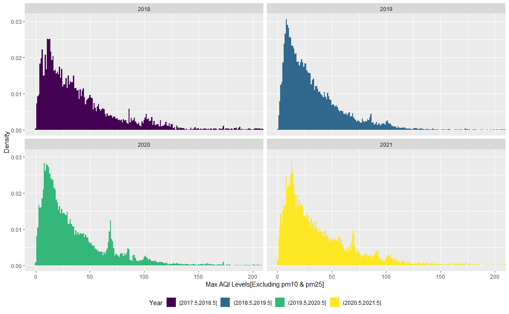
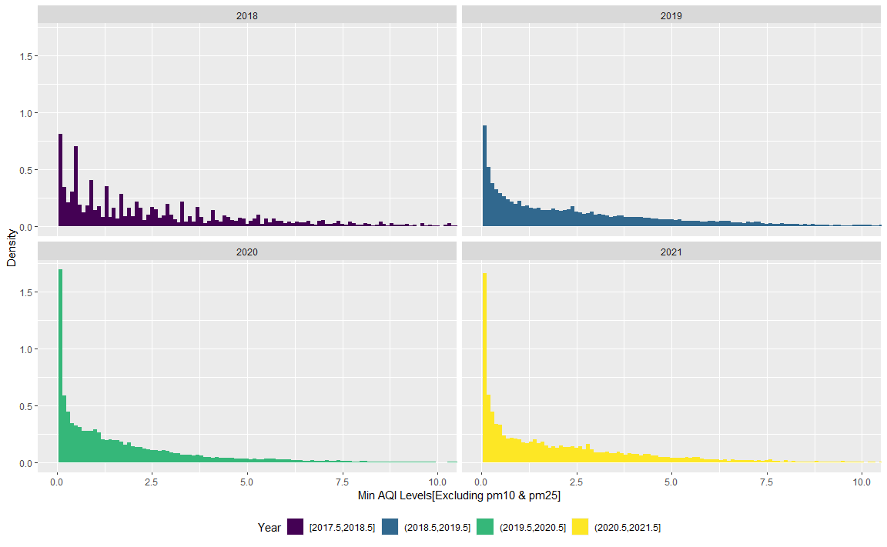
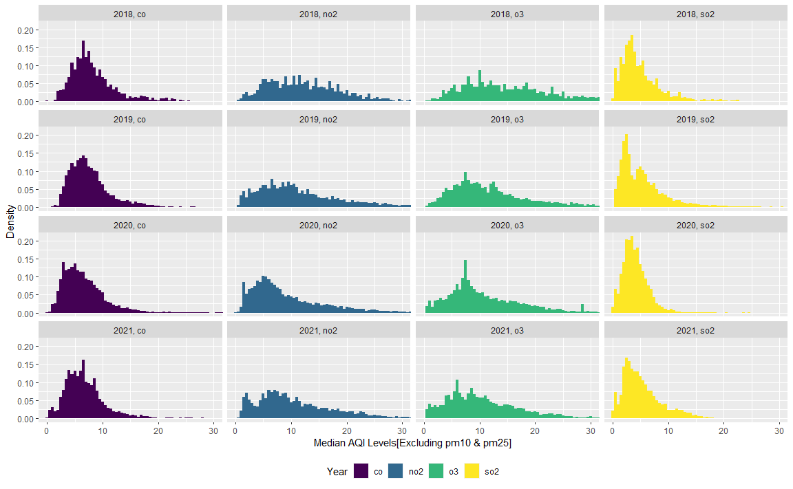

# INTRODUCTION

In this Data Analysis Project, I am going to work with **Air Quality Index Data of India**. I will be using several Statistical Tools to Analyze the Data which includes Exploratory Data Analysis, Techniques and methodologies used for Inference and will be Modelling the Data to summarize any pattern or general trend.

I will also try to find out if there was any significant drop in the levels pollutant gases in the Atmosphere due to imposing lockdowns in the year 2020 and 2021, when several industries, factories, transportation facilities were suspended to work. I will be comparing the data for 2020 and 2021 with the previous years.

### UNDERSTANDING THE DATASET

Let's take a look at the Data

<table class="table" style="margin-left: auto; margin-right: auto;">
<caption>First few rows of the Air Quality Index Data</caption>
 <thead>
  <tr>
   <th style="text-align:right;"> Year </th>
   <th style="text-align:right;"> Month </th>
   <th style="text-align:right;"> Day </th>
   <th style="text-align:left;"> City </th>
   <th style="text-align:left;"> Specie </th>
   <th style="text-align:right;"> count </th>
   <th style="text-align:right;"> min </th>
   <th style="text-align:right;"> max </th>
   <th style="text-align:right;"> median </th>
   <th style="text-align:right;"> variance </th>
  </tr>
 </thead>
<tbody>
  <tr>
   <td style="text-align:right;"> 2014 </td>
   <td style="text-align:right;"> 12 </td>
   <td style="text-align:right;"> 29 </td>
   <td style="text-align:left;"> Delhi </td>
   <td style="text-align:left;"> pm25 </td>
   <td style="text-align:right;"> 24 </td>
   <td style="text-align:right;"> 296.0 </td>
   <td style="text-align:right;"> 460.0 </td>
   <td style="text-align:right;"> 394.0 </td>
   <td style="text-align:right;"> 27226.40 </td>
  </tr>
  <tr>
   <td style="text-align:right;"> 2014 </td>
   <td style="text-align:right;"> 12 </td>
   <td style="text-align:right;"> 29 </td>
   <td style="text-align:left;"> Hyderabad </td>
   <td style="text-align:left;"> pm25 </td>
   <td style="text-align:right;"> 13 </td>
   <td style="text-align:right;"> 159.0 </td>
   <td style="text-align:right;"> 162.0 </td>
   <td style="text-align:right;"> 161.0 </td>
   <td style="text-align:right;"> 8.59 </td>
  </tr>
  <tr>
   <td style="text-align:right;"> 2014 </td>
   <td style="text-align:right;"> 12 </td>
   <td style="text-align:right;"> 29 </td>
   <td style="text-align:left;"> Delhi </td>
   <td style="text-align:left;"> pm10 </td>
   <td style="text-align:right;"> 82 </td>
   <td style="text-align:right;"> 79.0 </td>
   <td style="text-align:right;"> 999.0 </td>
   <td style="text-align:right;"> 218.0 </td>
   <td style="text-align:right;"> 634717.00 </td>
  </tr>
  <tr>
   <td style="text-align:right;"> 2014 </td>
   <td style="text-align:right;"> 12 </td>
   <td style="text-align:right;"> 29 </td>
   <td style="text-align:left;"> Delhi </td>
   <td style="text-align:left;"> o3 </td>
   <td style="text-align:right;"> 79 </td>
   <td style="text-align:right;"> 0.1 </td>
   <td style="text-align:right;"> 87.4 </td>
   <td style="text-align:right;"> 3.2 </td>
   <td style="text-align:right;"> 2324.38 </td>
  </tr>
  <tr>
   <td style="text-align:right;"> 2014 </td>
   <td style="text-align:right;"> 12 </td>
   <td style="text-align:right;"> 29 </td>
   <td style="text-align:left;"> Delhi </td>
   <td style="text-align:left;"> so2 </td>
   <td style="text-align:right;"> 91 </td>
   <td style="text-align:right;"> 0.3 </td>
   <td style="text-align:right;"> 21.2 </td>
   <td style="text-align:right;"> 4.2 </td>
   <td style="text-align:right;"> 231.83 </td>
  </tr>
  <tr>
   <td style="text-align:right;"> 2014 </td>
   <td style="text-align:right;"> 12 </td>
   <td style="text-align:right;"> 29 </td>
   <td style="text-align:left;"> Delhi </td>
   <td style="text-align:left;"> pm25 </td>
   <td style="text-align:right;"> 83 </td>
   <td style="text-align:right;"> 139.0 </td>
   <td style="text-align:right;"> 747.0 </td>
   <td style="text-align:right;"> 307.0 </td>
   <td style="text-align:right;"> 215149.00 </td>
  </tr>
</tbody>
</table>

<table class="table" style="margin-left: auto; margin-right: auto;">
<caption>Last few rows of the Air Quality Index Data</caption>
 <thead>
  <tr>
   <th style="text-align:right;"> Year </th>
   <th style="text-align:right;"> Month </th>
   <th style="text-align:right;"> Day </th>
   <th style="text-align:left;"> City </th>
   <th style="text-align:left;"> Specie </th>
   <th style="text-align:right;"> count </th>
   <th style="text-align:right;"> min </th>
   <th style="text-align:right;"> max </th>
   <th style="text-align:right;"> median </th>
   <th style="text-align:right;"> variance </th>
  </tr>
 </thead>
<tbody>
  <tr>
   <td style="text-align:right;"> 2021 </td>
   <td style="text-align:right;"> 6 </td>
   <td style="text-align:right;"> 24 </td>
   <td style="text-align:left;"> Kolkata </td>
   <td style="text-align:left;"> o3 </td>
   <td style="text-align:right;"> 48 </td>
   <td style="text-align:right;"> 2.9 </td>
   <td style="text-align:right;"> 105.7 </td>
   <td style="text-align:right;"> 8.4 </td>
   <td style="text-align:right;"> 4611.99 </td>
  </tr>
  <tr>
   <td style="text-align:right;"> 2021 </td>
   <td style="text-align:right;"> 6 </td>
   <td style="text-align:right;"> 24 </td>
   <td style="text-align:left;"> Kolkata </td>
   <td style="text-align:left;"> pm25 </td>
   <td style="text-align:right;"> 48 </td>
   <td style="text-align:right;"> 45.0 </td>
   <td style="text-align:right;"> 104.0 </td>
   <td style="text-align:right;"> 63.0 </td>
   <td style="text-align:right;"> 1398.61 </td>
  </tr>
  <tr>
   <td style="text-align:right;"> 2021 </td>
   <td style="text-align:right;"> 6 </td>
   <td style="text-align:right;"> 24 </td>
   <td style="text-align:left;"> Kolkata </td>
   <td style="text-align:left;"> pressure </td>
   <td style="text-align:right;"> 56 </td>
   <td style="text-align:right;"> 996.9 </td>
   <td style="text-align:right;"> 1007.5 </td>
   <td style="text-align:right;"> 999.3 </td>
   <td style="text-align:right;"> 67.94 </td>
  </tr>
  <tr>
   <td style="text-align:right;"> 2021 </td>
   <td style="text-align:right;"> 6 </td>
   <td style="text-align:right;"> 24 </td>
   <td style="text-align:left;"> Kolkata </td>
   <td style="text-align:left;"> wind-speed </td>
   <td style="text-align:right;"> 56 </td>
   <td style="text-align:right;"> 0.1 </td>
   <td style="text-align:right;"> 4.2 </td>
   <td style="text-align:right;"> 1.1 </td>
   <td style="text-align:right;"> 10.87 </td>
  </tr>
  <tr>
   <td style="text-align:right;"> 2021 </td>
   <td style="text-align:right;"> 6 </td>
   <td style="text-align:right;"> 24 </td>
   <td style="text-align:left;"> Kolkata </td>
   <td style="text-align:left;"> dew </td>
   <td style="text-align:right;"> 37 </td>
   <td style="text-align:right;"> 28.0 </td>
   <td style="text-align:right;"> 28.0 </td>
   <td style="text-align:right;"> 28.0 </td>
   <td style="text-align:right;"> 0.00 </td>
  </tr>
  <tr>
   <td style="text-align:right;"> 2021 </td>
   <td style="text-align:right;"> 6 </td>
   <td style="text-align:right;"> 24 </td>
   <td style="text-align:left;"> Kolkata </td>
   <td style="text-align:left;"> co </td>
   <td style="text-align:right;"> 48 </td>
   <td style="text-align:right;"> 1.0 </td>
   <td style="text-align:right;"> 5.2 </td>
   <td style="text-align:right;"> 2.3 </td>
   <td style="text-align:right;"> 16.41 </td>
  </tr>
</tbody>
</table>

-   This Data set contains 263890 rows and 10 columns.

-   The Year ranges from 2014 to 2021 (till June), with observations recorded on each of the 30 /31 days of the month for 12 months.

-   The Data is generated from the 22 City Stations for Real-Time Air-Quality Index Monitoring across the Country. The Cities include:

<table class="table" style="margin-left: auto; margin-right: auto;">
<caption>City Stations</caption>
 <thead>
  <tr>
   <th style="text-align:left;"> State </th>
   <th style="text-align:left;"> City </th>
   <th style="text-align:right;"> Number of Stations </th>
  </tr>
 </thead>
<tbody>
  <tr>
   <td style="text-align:left;"> Andhra_Pradesh </td>
   <td style="text-align:left;"> Visakhapatnam </td>
   <td style="text-align:right;"> 1 </td>
  </tr>
  <tr>
   <td style="text-align:left;"> Arunachal_Pradesh </td>
   <td style="text-align:left;"> Visakhapatnam </td>
   <td style="text-align:right;"> 1 </td>
  </tr>
  <tr>
   <td style="text-align:left;"> Bihar </td>
   <td style="text-align:left;"> Patna </td>
   <td style="text-align:right;"> 6 </td>
  </tr>
  <tr>
   <td style="text-align:left;"> Chandigarh </td>
   <td style="text-align:left;"> Chandigarh </td>
   <td style="text-align:right;"> 1 </td>
  </tr>
  <tr>
   <td style="text-align:left;"> Delhi </td>
   <td style="text-align:left;"> Delhi </td>
   <td style="text-align:right;"> 40 </td>
  </tr>
  <tr>
   <td style="text-align:left;"> Kerala </td>
   <td style="text-align:left;"> Thiruvananthapuram </td>
   <td style="text-align:right;"> 2 </td>
  </tr>
  <tr>
   <td style="text-align:left;"> Kerala </td>
   <td style="text-align:left;"> Thrissur </td>
   <td style="text-align:right;"> 1 </td>
  </tr>
  <tr>
   <td style="text-align:left;"> MadhyaPradesh </td>
   <td style="text-align:left;"> Bhopal </td>
   <td style="text-align:right;"> 1 </td>
  </tr>
  <tr>
   <td style="text-align:left;"> Maharashtra </td>
   <td style="text-align:left;"> Mumbai </td>
   <td style="text-align:right;"> 21 </td>
  </tr>
  <tr>
   <td style="text-align:left;"> Maharashtra </td>
   <td style="text-align:left;"> Nagpur </td>
   <td style="text-align:right;"> 1 </td>
  </tr>
  <tr>
   <td style="text-align:left;"> Maharashtra </td>
   <td style="text-align:left;"> Nashik </td>
   <td style="text-align:right;"> 1 </td>
  </tr>
  <tr>
   <td style="text-align:left;"> Meghalaya </td>
   <td style="text-align:left;"> Shillong </td>
   <td style="text-align:right;"> 1 </td>
  </tr>
  <tr>
   <td style="text-align:left;"> Rajasthan </td>
   <td style="text-align:left;"> Jaipur </td>
   <td style="text-align:right;"> 3 </td>
  </tr>
  <tr>
   <td style="text-align:left;"> Tamil_Nadu </td>
   <td style="text-align:left;"> Chennai </td>
   <td style="text-align:right;"> 8 </td>
  </tr>
  <tr>
   <td style="text-align:left;"> Telangana </td>
   <td style="text-align:left;"> Hyderabad </td>
   <td style="text-align:right;"> 6 </td>
  </tr>
  <tr>
   <td style="text-align:left;"> Uttar_Pradesh </td>
   <td style="text-align:left;"> Lucknow </td>
   <td style="text-align:right;"> 6 </td>
  </tr>
  <tr>
   <td style="text-align:left;"> Uttar_Pradesh </td>
   <td style="text-align:left;"> Muzaffarnagar </td>
   <td style="text-align:right;"> 1 </td>
  </tr>
  <tr>
   <td style="text-align:left;"> West_Bengal </td>
   <td style="text-align:left;"> Kolkata </td>
   <td style="text-align:right;"> 7 </td>
  </tr>
</tbody>
</table>

-   The parameters which we measure at the different Stations are given under the Specie Column and it includes -

<table class="table" style="margin-left: auto; margin-right: auto;">
<caption>Specie Description</caption>
 <thead>
  <tr>
   <th style="text-align:left;"> Parameters </th>
   <th style="text-align:left;"> Description </th>
   <th style="text-align:left;"> Units </th>
  </tr>
 </thead>
<tbody>
  <tr>
   <td style="text-align:left;"> pm25 </td>
   <td style="text-align:left;"> Particle pollution/particulate matter(particles less than or equal to 2.5 micrometers in diameter) </td>
   <td style="text-align:left;"> AQI </td>
  </tr>
  <tr>
   <td style="text-align:left;"> pm10 </td>
   <td style="text-align:left;"> Particle pollution/particulate matter(particles less than or equal to 10 micrometers in diameter) </td>
   <td style="text-align:left;"> AQI </td>
  </tr>
  <tr>
   <td style="text-align:left;"> o3 </td>
   <td style="text-align:left;"> Ground-level ozone </td>
   <td style="text-align:left;"> AQI </td>
  </tr>
  <tr>
   <td style="text-align:left;"> so2 </td>
   <td style="text-align:left;"> Sulfur dioxide </td>
   <td style="text-align:left;"> AQI </td>
  </tr>
  <tr>
   <td style="text-align:left;"> no2 </td>
   <td style="text-align:left;"> Nitrogen dioxide </td>
   <td style="text-align:left;"> AQI </td>
  </tr>
  <tr>
   <td style="text-align:left;"> co </td>
   <td style="text-align:left;"> Carbon Monoxide </td>
   <td style="text-align:left;"> AQI </td>
  </tr>
  <tr>
   <td style="text-align:left;"> temperature </td>
   <td style="text-align:left;"> Temperature </td>
   <td style="text-align:left;"> Degree Celcius </td>
  </tr>
  <tr>
   <td style="text-align:left;"> pressure </td>
   <td style="text-align:left;"> Air Pressure </td>
   <td style="text-align:left;"> NA </td>
  </tr>
  <tr>
   <td style="text-align:left;"> wind-gust </td>
   <td style="text-align:left;"> Wind Gust/Force </td>
   <td style="text-align:left;"> NA </td>
  </tr>
  <tr>
   <td style="text-align:left;"> humidity </td>
   <td style="text-align:left;"> Relative Humidity </td>
   <td style="text-align:left;"> NA </td>
  </tr>
  <tr>
   <td style="text-align:left;"> wind-speed </td>
   <td style="text-align:left;"> Wind Speed </td>
   <td style="text-align:left;"> NA </td>
  </tr>
  <tr>
   <td style="text-align:left;"> dew </td>
   <td style="text-align:left;"> Dew Point </td>
   <td style="text-align:left;"> NA </td>
  </tr>
  <tr>
   <td style="text-align:left;"> precipitation </td>
   <td style="text-align:left;"> Precipitation </td>
   <td style="text-align:left;"> NA </td>
  </tr>
</tbody>
</table>

The Air Quality Index (AQI) is an index for reporting air quality on a daily basis. It measures air pollution affects one's health within a short time period. The purpose of the AQI is to help people know how the local air quality impacts their health. The measurements in AQI are particularly helpful for our Data Analysis as it helps us compare the values at different stations and time points.

-   It also helps in identifying faulty standards and inadequate monitoring programmes.

-   AQI helps in analysing the change in air quality (improvement or degradation).

-   Comparing air quality conditions at different locations/cities.

<table class="table" style="margin-left: auto; margin-right: auto;">
<caption>Significance of the AQI Values</caption>
 <thead>
  <tr>
   <th style="text-align:left;"> AQI Values </th>
   <th style="text-align:left;"> Level of Health Concern </th>
  </tr>
 </thead>
<tbody>
  <tr>
   <td style="text-align:left;"> 0-50 </td>
   <td style="text-align:left;"> Good </td>
  </tr>
  <tr>
   <td style="text-align:left;"> 51-100 </td>
   <td style="text-align:left;"> Moderate </td>
  </tr>
  <tr>
   <td style="text-align:left;"> 101-150 </td>
   <td style="text-align:left;"> Unhealthy for sensitive group </td>
  </tr>
  <tr>
   <td style="text-align:left;"> 151-200 </td>
   <td style="text-align:left;"> Unhealthy </td>
  </tr>
  <tr>
   <td style="text-align:left;"> 201-300 </td>
   <td style="text-align:left;"> Very Unhealthy </td>
  </tr>
  <tr>
   <td style="text-align:left;"> 301-500 </td>
   <td style="text-align:left;"> Hazardous </td>
  </tr>
</tbody>
</table>

In further Analysis we will call pm25, pm10, o3, so2, no2 and co2 as pollutants and the remaining parameters as non-pollutants.

-   For Each parameters in Specie we measure it's minimum value, median value, maximum value and variance . The count variable is the number of times the measurement was taken for each of the parameters.

### TOP CITY STATIONS

Here we try to analyze which City Stations

-   Records More Observations compared to others, which will give us an idea of those centres being more frequently continuously recorded, which can be due to higher AQI Levels in the pollutants.

<table class="table" style="margin-left: auto; margin-right: auto;">
<caption>Observations recorded per City Station per Year</caption>
 <thead>
  <tr>
   <th style="text-align:left;"> City </th>
   <th style="text-align:right;"> 2014 </th>
   <th style="text-align:right;"> 2015 </th>
   <th style="text-align:right;"> 2016 </th>
   <th style="text-align:right;"> 2017 </th>
   <th style="text-align:right;"> 2018 </th>
   <th style="text-align:right;"> 2019 </th>
   <th style="text-align:right;"> 2020 </th>
   <th style="text-align:right;"> 2021 </th>
  </tr>
 </thead>
<tbody>
  <tr>
   <td style="text-align:left;"> Delhi </td>
   <td style="text-align:right;"> 21 </td>
   <td style="text-align:right;"> 1320 </td>
   <td style="text-align:right;"> 1328 </td>
   <td style="text-align:right;"> 1280 </td>
   <td style="text-align:right;"> 1713 </td>
   <td style="text-align:right;"> 6099 </td>
   <td style="text-align:right;"> 6844 </td>
   <td style="text-align:right;"> 3159 </td>
  </tr>
  <tr>
   <td style="text-align:left;"> Mumbai </td>
   <td style="text-align:right;"> 3 </td>
   <td style="text-align:right;"> 437 </td>
   <td style="text-align:right;"> 1110 </td>
   <td style="text-align:right;"> 1098 </td>
   <td style="text-align:right;"> 1154 </td>
   <td style="text-align:right;"> 4236 </td>
   <td style="text-align:right;"> 4415 </td>
   <td style="text-align:right;"> 2004 </td>
  </tr>
  <tr>
   <td style="text-align:left;"> Bengaluru </td>
   <td style="text-align:right;"> 5 </td>
   <td style="text-align:right;"> 524 </td>
   <td style="text-align:right;"> 1094 </td>
   <td style="text-align:right;"> 1097 </td>
   <td style="text-align:right;"> 1186 </td>
   <td style="text-align:right;"> 4210 </td>
   <td style="text-align:right;"> 4328 </td>
   <td style="text-align:right;"> 1971 </td>
  </tr>
  <tr>
   <td style="text-align:left;"> Ghaziabad </td>
   <td style="text-align:right;"> NA </td>
   <td style="text-align:right;"> NA </td>
   <td style="text-align:right;"> NA </td>
   <td style="text-align:right;"> NA </td>
   <td style="text-align:right;"> 11 </td>
   <td style="text-align:right;"> 4180 </td>
   <td style="text-align:right;"> 4356 </td>
   <td style="text-align:right;"> 1970 </td>
  </tr>
  <tr>
   <td style="text-align:left;"> Hyderabad </td>
   <td style="text-align:right;"> 3 </td>
   <td style="text-align:right;"> 401 </td>
   <td style="text-align:right;"> 1087 </td>
   <td style="text-align:right;"> 1089 </td>
   <td style="text-align:right;"> 848 </td>
   <td style="text-align:right;"> 4149 </td>
   <td style="text-align:right;"> 4556 </td>
   <td style="text-align:right;"> 2135 </td>
  </tr>
  <tr>
   <td style="text-align:left;"> Jaipur </td>
   <td style="text-align:right;"> NA </td>
   <td style="text-align:right;"> 6 </td>
   <td style="text-align:right;"> 1016 </td>
   <td style="text-align:right;"> 838 </td>
   <td style="text-align:right;"> 1103 </td>
   <td style="text-align:right;"> 4138 </td>
   <td style="text-align:right;"> 4329 </td>
   <td style="text-align:right;"> 2009 </td>
  </tr>
</tbody>
</table>

It is clearly visible that Delhi is definitely the most monitored centre, which is due to the presence the highest number of Real-Time Air Monitoring Stations in Delhi and more frequent montioring which is due to high AQI Levels which we will see in further analysis. The other centres have more or less the same number of observations.

-   Now Let's take a look at the Average Median AQI Levels of the Pollutants every year Station-wise. The Top 11 Stations will be considered in the further analysis where ever we need to do a Station-wise breakdown of Data or Analysis.

<table class="table" style="margin-left: auto; margin-right: auto;">
<caption>Average Median AQI Levels of Top 11 City Stations</caption>
 <thead>
  <tr>
   <th style="text-align:left;"> City </th>
   <th style="text-align:right;"> 2014 </th>
   <th style="text-align:right;"> 2015 </th>
   <th style="text-align:right;"> 2016 </th>
   <th style="text-align:right;"> 2017 </th>
   <th style="text-align:right;"> 2018 </th>
   <th style="text-align:right;"> 2019 </th>
   <th style="text-align:right;"> 2020 </th>
   <th style="text-align:right;"> 2021 </th>
  </tr>
 </thead>
<tbody>
  <tr>
   <td style="text-align:left;"> Delhi </td>
   <td style="text-align:right;"> 132.28571 </td>
   <td style="text-align:right;"> 75.80250 </td>
   <td style="text-align:right;"> 84.49887 </td>
   <td style="text-align:right;"> 75.09305 </td>
   <td style="text-align:right;"> 79.38403 </td>
   <td style="text-align:right;"> 72.71864 </td>
   <td style="text-align:right;"> 66.22442 </td>
   <td style="text-align:right;"> 74.17862 </td>
  </tr>
  <tr>
   <td style="text-align:left;"> Ghaziabad </td>
   <td style="text-align:right;"> NA </td>
   <td style="text-align:right;"> NA </td>
   <td style="text-align:right;"> NA </td>
   <td style="text-align:right;"> NA </td>
   <td style="text-align:right;"> 151.88333 </td>
   <td style="text-align:right;"> 60.61417 </td>
   <td style="text-align:right;"> 55.16624 </td>
   <td style="text-align:right;"> 63.21880 </td>
  </tr>
  <tr>
   <td style="text-align:left;"> Muzaffarnagar </td>
   <td style="text-align:right;"> NA </td>
   <td style="text-align:right;"> NA </td>
   <td style="text-align:right;"> NA </td>
   <td style="text-align:right;"> NA </td>
   <td style="text-align:right;"> 99.41667 </td>
   <td style="text-align:right;"> 49.24321 </td>
   <td style="text-align:right;"> 48.52875 </td>
   <td style="text-align:right;"> 55.38776 </td>
  </tr>
  <tr>
   <td style="text-align:left;"> Lucknow </td>
   <td style="text-align:right;"> 45.34167 </td>
   <td style="text-align:right;"> 27.80456 </td>
   <td style="text-align:right;"> 47.30801 </td>
   <td style="text-align:right;"> 49.22979 </td>
   <td style="text-align:right;"> 45.82328 </td>
   <td style="text-align:right;"> 39.11255 </td>
   <td style="text-align:right;"> 45.46136 </td>
   <td style="text-align:right;"> 54.03193 </td>
  </tr>
  <tr>
   <td style="text-align:left;"> Hapur </td>
   <td style="text-align:right;"> NA </td>
   <td style="text-align:right;"> NA </td>
   <td style="text-align:right;"> NA </td>
   <td style="text-align:right;"> NA </td>
   <td style="text-align:right;"> 100.00000 </td>
   <td style="text-align:right;"> 52.50352 </td>
   <td style="text-align:right;"> 44.98838 </td>
   <td style="text-align:right;"> 48.94888 </td>
  </tr>
  <tr>
   <td style="text-align:left;"> Patna </td>
   <td style="text-align:right;"> NA </td>
   <td style="text-align:right;"> 68.51000 </td>
   <td style="text-align:right;"> 38.48277 </td>
   <td style="text-align:right;"> 42.99115 </td>
   <td style="text-align:right;"> 44.43895 </td>
   <td style="text-align:right;"> 41.59399 </td>
   <td style="text-align:right;"> 36.66967 </td>
   <td style="text-align:right;"> 46.86358 </td>
  </tr>
  <tr>
   <td style="text-align:left;"> Gandhinagar </td>
   <td style="text-align:right;"> 27.15000 </td>
   <td style="text-align:right;"> 46.16173 </td>
   <td style="text-align:right;"> 42.24333 </td>
   <td style="text-align:right;"> 58.07122 </td>
   <td style="text-align:right;"> 59.86312 </td>
   <td style="text-align:right;"> 38.95743 </td>
   <td style="text-align:right;"> 34.07332 </td>
   <td style="text-align:right;"> 42.43792 </td>
  </tr>
  <tr>
   <td style="text-align:left;"> Kolkata </td>
   <td style="text-align:right;"> 259.00000 </td>
   <td style="text-align:right;"> 135.90426 </td>
   <td style="text-align:right;"> 129.69352 </td>
   <td style="text-align:right;"> 43.30009 </td>
   <td style="text-align:right;"> 49.56707 </td>
   <td style="text-align:right;"> 42.06618 </td>
   <td style="text-align:right;"> 33.27508 </td>
   <td style="text-align:right;"> 42.15740 </td>
  </tr>
  <tr>
   <td style="text-align:left;"> Jaipur </td>
   <td style="text-align:right;"> NA </td>
   <td style="text-align:right;"> 56.18333 </td>
   <td style="text-align:right;"> 53.62057 </td>
   <td style="text-align:right;"> 45.49523 </td>
   <td style="text-align:right;"> 47.28734 </td>
   <td style="text-align:right;"> 38.77708 </td>
   <td style="text-align:right;"> 35.41928 </td>
   <td style="text-align:right;"> 41.47772 </td>
  </tr>
  <tr>
   <td style="text-align:left;"> Chandigarh </td>
   <td style="text-align:right;"> NA </td>
   <td style="text-align:right;"> 36.78000 </td>
   <td style="text-align:right;"> 29.56680 </td>
   <td style="text-align:right;"> 30.44762 </td>
   <td style="text-align:right;"> 35.00841 </td>
   <td style="text-align:right;"> 36.04891 </td>
   <td style="text-align:right;"> 35.53375 </td>
   <td style="text-align:right;"> 38.86554 </td>
  </tr>
  <tr>
   <td style="text-align:left;"> Mumbai </td>
   <td style="text-align:right;"> 171.66667 </td>
   <td style="text-align:right;"> 67.26247 </td>
   <td style="text-align:right;"> 34.35991 </td>
   <td style="text-align:right;"> 36.24845 </td>
   <td style="text-align:right;"> 49.11408 </td>
   <td style="text-align:right;"> 33.10925 </td>
   <td style="text-align:right;"> 30.21040 </td>
   <td style="text-align:right;"> 38.10787 </td>
  </tr>
  <tr>
   <td style="text-align:left;"> Visakhapatnam </td>
   <td style="text-align:right;"> NA </td>
   <td style="text-align:right;"> NA </td>
   <td style="text-align:right;"> 45.29118 </td>
   <td style="text-align:right;"> 39.60440 </td>
   <td style="text-align:right;"> 44.05279 </td>
   <td style="text-align:right;"> 36.30747 </td>
   <td style="text-align:right;"> 32.97047 </td>
   <td style="text-align:right;"> 38.10200 </td>
  </tr>
  <tr>
   <td style="text-align:left;"> Bhopal </td>
   <td style="text-align:right;"> NA </td>
   <td style="text-align:right;"> NA </td>
   <td style="text-align:right;"> NA </td>
   <td style="text-align:right;"> NA </td>
   <td style="text-align:right;"> 52.06531 </td>
   <td style="text-align:right;"> 38.79051 </td>
   <td style="text-align:right;"> 33.07403 </td>
   <td style="text-align:right;"> 36.94878 </td>
  </tr>
  <tr>
   <td style="text-align:left;"> Hyderabad </td>
   <td style="text-align:right;"> 128.00000 </td>
   <td style="text-align:right;"> 61.56534 </td>
   <td style="text-align:right;"> 36.34029 </td>
   <td style="text-align:right;"> 43.35620 </td>
   <td style="text-align:right;"> 50.91969 </td>
   <td style="text-align:right;"> 33.32681 </td>
   <td style="text-align:right;"> 30.05922 </td>
   <td style="text-align:right;"> 36.20543 </td>
  </tr>
  <tr>
   <td style="text-align:left;"> Nashik </td>
   <td style="text-align:right;"> NA </td>
   <td style="text-align:right;"> NA </td>
   <td style="text-align:right;"> 51.03056 </td>
   <td style="text-align:right;"> 41.11010 </td>
   <td style="text-align:right;"> 38.22255 </td>
   <td style="text-align:right;"> 30.47740 </td>
   <td style="text-align:right;"> 27.66307 </td>
   <td style="text-align:right;"> 34.79266 </td>
  </tr>
  <tr>
   <td style="text-align:left;"> Shillong </td>
   <td style="text-align:right;"> NA </td>
   <td style="text-align:right;"> NA </td>
   <td style="text-align:right;"> NA </td>
   <td style="text-align:right;"> NA </td>
   <td style="text-align:right;"> NA </td>
   <td style="text-align:right;"> 29.25296 </td>
   <td style="text-align:right;"> 26.55895 </td>
   <td style="text-align:right;"> 34.77732 </td>
  </tr>
  <tr>
   <td style="text-align:left;"> Nagpur </td>
   <td style="text-align:right;"> NA </td>
   <td style="text-align:right;"> NA </td>
   <td style="text-align:right;"> 23.29974 </td>
   <td style="text-align:right;"> 45.37208 </td>
   <td style="text-align:right;"> 37.19080 </td>
   <td style="text-align:right;"> 36.23182 </td>
   <td style="text-align:right;"> 29.37133 </td>
   <td style="text-align:right;"> 34.19137 </td>
  </tr>
  <tr>
   <td style="text-align:left;"> Bengaluru </td>
   <td style="text-align:right;"> 4.44000 </td>
   <td style="text-align:right;"> 12.79294 </td>
   <td style="text-align:right;"> 36.30832 </td>
   <td style="text-align:right;"> 28.59490 </td>
   <td style="text-align:right;"> 31.89567 </td>
   <td style="text-align:right;"> 29.59513 </td>
   <td style="text-align:right;"> 26.55614 </td>
   <td style="text-align:right;"> 29.91554 </td>
  </tr>
  <tr>
   <td style="text-align:left;"> Mysore </td>
   <td style="text-align:right;"> NA </td>
   <td style="text-align:right;"> NA </td>
   <td style="text-align:right;"> NA </td>
   <td style="text-align:right;"> NA </td>
   <td style="text-align:right;"> NA </td>
   <td style="text-align:right;"> 25.51613 </td>
   <td style="text-align:right;"> 17.65821 </td>
   <td style="text-align:right;"> 25.45951 </td>
  </tr>
  <tr>
   <td style="text-align:left;"> Thiruvananthapuram </td>
   <td style="text-align:right;"> NA </td>
   <td style="text-align:right;"> NA </td>
   <td style="text-align:right;"> NA </td>
   <td style="text-align:right;"> NA </td>
   <td style="text-align:right;"> 30.65580 </td>
   <td style="text-align:right;"> 24.07198 </td>
   <td style="text-align:right;"> 24.34395 </td>
   <td style="text-align:right;"> 25.12243 </td>
  </tr>
  <tr>
   <td style="text-align:left;"> Thrissur </td>
   <td style="text-align:right;"> NA </td>
   <td style="text-align:right;"> NA </td>
   <td style="text-align:right;"> NA </td>
   <td style="text-align:right;"> NA </td>
   <td style="text-align:right;"> NA </td>
   <td style="text-align:right;"> 12.87060 </td>
   <td style="text-align:right;"> 18.73273 </td>
   <td style="text-align:right;"> 25.08202 </td>
  </tr>
  <tr>
   <td style="text-align:left;"> Chennai </td>
   <td style="text-align:right;"> 42.51875 </td>
   <td style="text-align:right;"> 33.63261 </td>
   <td style="text-align:right;"> 31.57973 </td>
   <td style="text-align:right;"> 28.69913 </td>
   <td style="text-align:right;"> 27.57224 </td>
   <td style="text-align:right;"> 23.46841 </td>
   <td style="text-align:right;"> 21.70384 </td>
   <td style="text-align:right;"> 22.78234 </td>
  </tr>
</tbody>
</table>

# VISUAL OVERVIEW

-   Here we will look at several visualization to get an approximate idea about the spread, patterns, trends and key facts to notice about the Data, which will greatly impact our further Analysis and will prove helpful in finding out the parts of the Data which needs to be observed and tested carefully to provide valuable insight.

<!-- -->

Here, from above bar plot, we see that the year 2020 was the one with the least levels of Pollutants compared to all the other years. 2021 has seen a hike in the AQI levels, which maybe due to opening of the factories, industries and also starting of Transportation facilities in many States. Though we cannot totally claim that, because we don't have data pertaining to entire of 2021.

<!-- -->

Taking look at the Top 11 Stations we can also see a drop in the AQI levels in the year 2020.

-   Here is an interesting relationship between month and average AQI levels per day of that Month, where we see that the AQI levels in each Measure drop almost linearly till July each year and then it starts rising. We will later explore this relationship in the Modelling Part of this Analysis.

<!-- -->

-   The Past 4 years Station-wise we can see the same pattern with Delhi being at the top of each month. This answers the question of why Delhi has so many more Observations recorded per year as compared to the other Stations. It's the concerning and high levels of AQI levels.

-   Now we see even more revealing pattern when we plot our Top 11 Station's Measure of AQI Levels in the last 4 years. The Maximum AQI Levels measured each day per month increases and then decreases till July where previously in the above plot which merged all the Stations didn't showed this much. This kind of behavior is ore pronounced in Delhi.

<!-- -->

-   Let's turn to the Pollutant-wise breakdown of the AQI Levels, which may help us find out weather it was actually the Lockdowns which may have caused a dip in the AQI levels during the year 2020.

<!-- -->

Here we can clearly see that each Pollutant has decreased in the Year 2020 compared to all the other Years. But more interesting is the fact that particuate matter of both sizes have shown a big drop. Particulate Matters are mostly contributed by Vehicles, Transportation facilities and some Industries like Cement, etc. Since, there was lockdown we see it might have caused such a dip. Other Pollutants have also seen drop in the Year 2020. Further in the Analysis we will do Statistical Tests to find out if these drops were significant or not.

<!-- -->

### DISTRIBUTIONS

Distributions are key in deciding any changes been made to the system generating the data. They help us distinguish between two different groups. They help us look at the spread of the data and helps us take important decisions regarding what inferential techniques we can use and what sort of assumptions are valid. They are also fundamental part before doing any kind of Testing or Model Building.

-   Let's take a look at the Yearly Distribution of the Median AQI Levels

<!-- -->

They look quite familiar to Gamma Distribution. Later in the Inference Part we will try to find out the parameters and will do several Tests to verify this. We will also perform tests for whether the Year 2020 saw a dip in these AQI Levels.

We see more or less same distribution for Maximum AQI Levels and Minimum AQI Levels.

-   A Pollutant-wise (Excluding pm10 and pm25) breakdown of the Median AQI Levels also reveal similar Gamma looking Distributions but with different parameters.

<!-- -->

-   Now in all these above plots we have skipped pm10 and pm25 since they have much higher values of AQI compared to these gases. So, we won't be able to fit them in the above plots. Added with that pm25 doesn't seem to follow some known distribution. We will later see if any transformation or change can help us model that.

<!-- -->

### RELATIONSHIPS - PATTERNS & TRENDS

Here we are going to explore the visual relationships between all the pollutants with all the other pollutants and not only that, it is important to realize that the non-pollutants also play a crucial role in deciding the level of pollutants measured. We will see more of it below in this section as well as a lot of it in the section where we build our Models. These relationships are best exposed with Scatter plots. Here we will take a look at these.

-   Here we look at the Scatter Plot matrix of the Pollutants where we have summarized the data in Yearly & Monthly basis so as to make the plots less overwhelming and more interpretable. We see strong correlation between all these marginals plots. Which can be attributed due to the conversions of one gas to the other that takes place naturally in the atmosphere. But we must also be careful that it may happen that these individual pollutants are related due to some other underlying common feature, which we will explore further in the Model Building section.

<!-- --><!-- -->

Here we see that the non-pollutants also have strong correlations among themselves, which can be attributed for the fact that temperature, pressure, humidity, wind-speed, etc. are physically strongly related.

-   Let's take a look at the dependence of the Pollutants on Non-Pollutants

<!-- -->

There is a significiant relationship between each of the non-pollutants on the AQI levels of the pollutants, which may be due to the fact that wind speeds, temperature, pressure, humidity, etc. changes the concentration of the pollutants in the Air. There are other physical processes in nature that also strongly intertwine them. We will see more of it in the later sections.

-   There is also one more thing which can prove to be really helpful in understanding the relationship between the pollutants that is the variance of these parameters measured each day at the stations at real-time. Where we can see how these parameters variances are related. I haven't included the scatterplot matrix of the non-pollutants and of the pollutants and non-pollutants, as they visually don't convey much. But we will surely work with them in the later section.

<!-- -->

So, with this visual picture of the Data in mind. We wrap the Visual Overview and most part of the EDA here. In the next section we will draw inferences from the data using several Inferential Statistical Technique.
