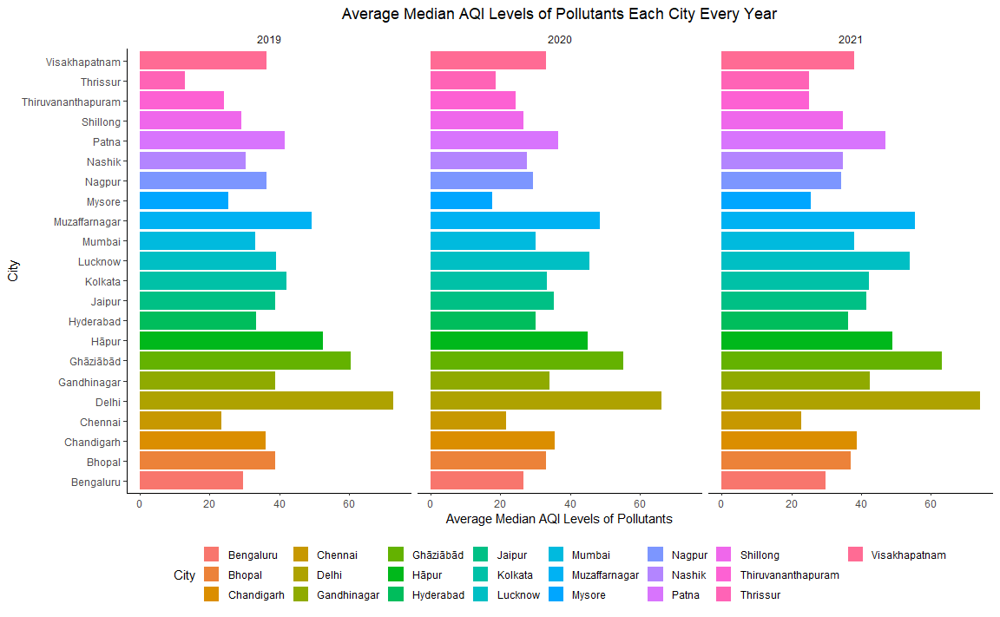

# Air Quality Index of India 2021

As a Part of My First Year Spring Semester, Statistical Methods-II Project, I have chosen this topic to explore more about the condition of India's Air Quality Index & Pollutant Levels. \
In this Project my Primary Focus was to find out whether there was a Statistical Impact of COVID-19 related measures like suspension of Travel, Transportation, Industrial Work, etc. on the Levels of Pollutants Measured at various Cities. 
 
I have explored a lot and have learned more techniques on Data Visualization and Presentation. I even wrote big chunks of R-Codes for general purpose use not specific to this Project Only and have learnt a lot from them. 
Some of the Topics which I really enjoyed and learnt from this Project are:
- **R Markdown, Completed the entire book 'R for Data Science'(Learnt Tidyverse, ggplot, dplyr, modelr and other R packages)**: I learnt using R Markdown, understood concepts and components that make up for good data visualization. I also learnt and applied advanced data wrangling techniques to reshape and transform data. 
- **Fitting Models to Distributions**: I used several techniques to fit probability density function to the histogram of the data like Maximum Likelihood, Hellinger Distance and few more. I compared the results by using goodness of fit test to pick up the best fit out of few preselected model classes which seemed close to the shape of the data. For much detailed analysis see the report.
- **Simulation and Inferential Statistics**: I used several tools from inferential statistics(Hypothesis Testing) as well as estimation theory(Interval and Point Estimation) to give a better insight and quantification of measure of change of AQI Levels. It includes confidence intervals, MLE, test for equality of means, variance, ANOVA test, chisquare goodness of fit. I used simulation based techniques like bootstrapping to generate these results in a non-parametric way also.
- **Modelling Real World Data**: I used multiple linear regression to model the dependence of pollutants on the other pollutants as well as the AQI Levels on the pollutants and weather factors. I used multiple R-squared as the metric for evaluation of model performance.

Though there are few portions of my R-Codes which I wrote in-order to explore the Data, which had some important story to tell weren't able to make their way up in the Report mainly because of the restriction on the length of the Project and partly because of some Time Constraints.\
There are some genuine drawbacks which I didn't refered to in this project that is Multicollinearity, and few related issues.\
Mostly becausse I didn't have much knowledge and idea on them when I started with this Project. Though I will definitely return back with an updated more relevant dataset to respond and make important changes, once I know some more techniques to efficiently handle these issues along with some other interesting Modelling & Inferential Techniques.

**RUN**: The Project is available as **Analysis_Report.md** and **Analysis_Report.pdf** to be viewed on Github itself. I hope you Enjoy looking at my work.
